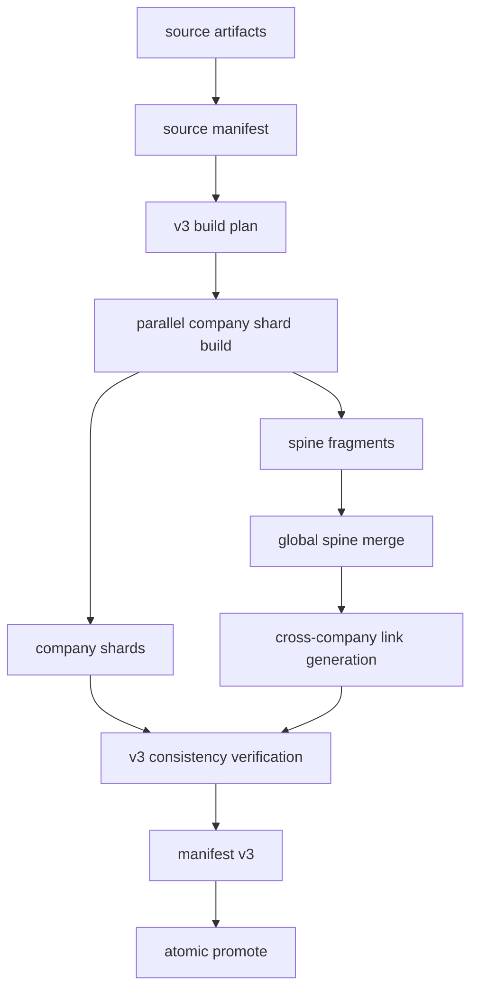

# KRW Ontology v3 global spine and company shards development guide

기준일: 2026-06-12

> 최종 결정, 현재 구현 상태, 남은 차단 항목, 운영 runbook의 통합 기준은
> [`v3-final-production-master-development-guide.md`](v3-final-production-master-development-guide.md)다.
> 이 문서는 architecture와 schema 상세 기준으로 사용한다.

이 문서는 `krw-ontology`의 production index serving 구조를 v3로 전면
전환하기 위한 개발 기준 문서다. v3의 핵심은 production runtime에서 90GB급
monolith index를 제거하고, `global_spine.sqlite`와 회사별 shard만으로 검색,
trace, chain, compare, quality, release verification, prod publish를 처리하는
것이다.

이 문서는 임시 계획이나 안정화 전 단계가 아니다. 구현 완료 기준은 v3가
production 기본 구조가 되는 것이다.

실제 구현 순서, 파일별 수정 범위, 테스트, 운영 명령, 완료 체크리스트는
[`v3-final-production-conversion-development-plan.md`](v3-final-production-conversion-development-plan.md)
를 함께 따른다. 개발자가 바로 이어서 작업할 때 필요한 파일별 구현 지침,
명령어 계약, 운영 runbook, 리뷰 체크리스트는
[`v3-production-implementation-handoff.md`](v3-production-implementation-handoff.md)를
따른다.
최종 구현 명세, 작업 패키지, 검증 기준, 운영 판단 기준은
[`v3-final-production-development-spec.md`](v3-final-production-development-spec.md)를
함께 따른다.

## 0. 문서 사용법과 우선순위

최종 결정, 현재 구현 상태, 남은 차단 항목의 source of truth는
[`v3-final-production-master-development-guide.md`](v3-final-production-master-development-guide.md)다.
이 문서는 v3 schema, build DAG, router, verification의 상세 계약을 담당한다.
기존 v2 문서나 현재 코드가 이 상세 계약과 충돌하면 차이를 명시적으로 해결해야 한다.
실제 배포 전에는 코드와 테스트가 마스터 기준서와 이 상세 계약을 모두 만족해야 한다.

우선순위:

```text
1. production correctness
2. immutable release와 atomic promote
3. monolith 없는 serving correctness
4. 관측 가능한 build/release/quality/MCP 상태
5. cache, partial rebuild, delta publish 성능
```

해석 규칙:

1. "나중에"는 임시 배제를 뜻하지 않는다. 의존성 순서상 뒤에 구현할 수 있다는
   뜻일 뿐, v3 완료 정의에서는 모두 포함한다.
2. "force"는 새 release 생성을 강제한다는 뜻이다. cache를 무조건 버린다는 뜻이
   아니다.
3. "production"은 prod 환경만 뜻하지 않는다. dev release도 production 계약으로
   만들어야 한다.
4. `agent_index.sqlite`는 production v3 기본 산출물이 아니다.
5. v1/v2 호환 serving은 만들지 않는다. 전환 후 정상 target은 v3뿐이다.

## 1. 확정 결정

아래 결정은 구현 중 다시 흔들면 안 되는 계약이다.

1. production 기본 index layout은 `global-spine-and-company-shards`다.
2. production release에는 monolith `agent_index.sqlite`를 포함하지 않는다.
3. v1/v2 release 호환은 제공하지 않는다. 새 코드의 정상 target은 v3 release다.
4. `global_spine.sqlite`가 production serving의 전역 routing, connectivity,
   chain planning index다.
5. 회사별 shard는 full evidence store다.
6. MCP runtime은 production에서 monolith fallback을 사용하지 않는다.
7. quality는 release root를 받아 `global_spine.sqlite`와 company shards를 읽는다.
8. `force`는 새 release 강제 생성을 의미한다. cache 무시는 `--no-cache`로만 한다.
9. 중단되었거나 promote되지 않은 v2 candidate는 정리 대상이다.
10. v3는 최소 구현이 아니라 완성형 범위로 구현한다.
11. 장기 production 기준에서 "일단 monolith도 같이 만들자"는 기본값으로 허용하지
    않는다. 필요한 경우 `debug/monolith.sqlite`를 명시 옵션으로만 만든다.
12. CLI는 일상 운영자가 짧은 명령으로 써야 한다. 긴 경로 옵션은 config가 없는
    복구/디버그 상황에서만 필요해야 한다.
13. quality check는 prod publish gate가 아니다. 사용자가 원할 때 실행하는 독립
    검증 명령이다.
14. quality repair는 release를 직접 고치지 않는다. source/running-root를 고친 뒤
    새 v3 release를 다시 만든다.
15. MCP startup은 deep verification을 하지 않는다. deep verification은 release
    생성과 publish 이전 단계의 책임이다.

## 2. 왜 v3가 필요한가

현재 v2 `monolith-and-shards` 구조는 correctness를 확보하는 중간 단계로는
타당하지만 장기 production 최종형은 아니다.

v2 구조:

```text
indexes/
  agent_index.sqlite          # full graph, 90GB+
  global_catalog.sqlite
  global_topics.sqlite
  shard_manifest.json
  companies/
    AAPL.sqlite
    MSFT.sqlite
```

문제:

1. 같은 object, edge, quality, lookup 데이터가 monolith와 shard에 중복 저장된다.
2. full force build가 `monolith build -> shard build -> monolith parity verify`로
   이어져 시간이 길다.
3. prod bundle에 90GB급 fallback이 남아 delta publish 효과가 줄어든다.
4. router가 monolith fallback에 기대면 spine/shard routing 개선이 계속 미뤄진다.
5. 데이터가 커질수록 저장공간, build 시간, upload 시간이 모두 커진다.

v3의 역할 분리:

```text
global_spine.sqlite
  전체 온톨로지 연결성, routing, chain planning, no-ticker discovery

companies/<TICKER>.sqlite
  해당 회사의 full evidence, quote, payload, trace detail

debug/monolith.sqlite
  선택적 debug/offline parity artifact. production 기본 아님
```

핵심 원칙:

```text
company shard = evidence storage
global spine = ontology connectivity
production runtime = no monolith
```

## 3. 목표와 비목표

### 3.1 목표

1. monolith 없이 production MCP가 정상 동작한다.
2. ticker query는 해당 company shard를 직접 사용한다.
3. no-ticker query는 global spine에서 후보 ticker, topic, factor, entity를 찾은 뒤
   필요한 shard만 fanout한다.
4. chain query는 `global_chain_index`, `global_edge_spine`, factor/topic/entity/metric
   spine을 사용해 path를 계획하고, shard에서 evidence를 lazy fetch한다.
5. trace query는 `global_object_locator`로 object 위치를 찾고 shard에서 detail을
   읽는다.
6. compare query는 global metric/topic/factor key로 normalize한 뒤 shard 결과를
   merge한다.
7. quality는 global/shard consistency와 shard 내부 quality를 함께 검사한다.
8. release verify는 monolith integrity가 아니라 v3 topology consistency를 검사한다.
9. prod publish는 `global_spine.sqlite`, company shards, manifest, verify reports만
   배포한다.
10. 새 ticker 추가나 일부 ticker 수정은 해당 shard와 spine fragment만 rebuild하고,
    global spine은 compact merge로 갱신한다.

### 3.2 비목표

1. v2 release를 계속 serving하는 호환 layer를 만들지 않는다.
2. production에서 monolith fallback을 남기지 않는다.
3. `global_catalog` 수준의 단순 목록 index로 끝내지 않는다.
4. cross-company chain을 나중으로 미루지 않는다.
5. full evidence text를 global spine에 중복 저장하지 않는다.
6. 회사별 ontology artifact를 사람이 다시 맞추는 작업으로 만들지 않는다.

## 4. 용어

| 용어 | 의미 |
| --- | --- |
| source artifact | running root 또는 release root의 회사별 ontology artifact |
| source manifest | build input artifact 목록과 content hash의 source of truth |
| company shard | 한 ticker의 full evidence SQLite index |
| spine fragment | 한 ticker shard build에서 나온 global spine 입력 조각 |
| global spine | 전체 연결성, routing, chain planning을 담당하는 compact global index |
| debug monolith | 명시 옵션으로만 만드는 offline verification artifact |
| force | 새 release를 강제로 생성하는 작업 |
| no-cache | cache를 무시하고 source artifact에서 전부 다시 만드는 작업 |
| dirty company | source manifest 또는 builder version 변화로 rebuild가 필요한 ticker |

## 5. v3 release layout

기본 release layout:

```text
<releases_root>/<env>/<release_id>/
  manifest.json
  source_manifest.json

  companies/
    AAPL/
    MSFT/

  indexes/
    global_spine.sqlite
    shard_manifest.json
    build_plan.json
    build_summary.json
    build_progress.jsonl
    fragments/
      spine/
        AAPL.sqlite
        MSFT.sqlite
    companies/
      AAPL.sqlite
      MSFT.sqlite

  verify/
    release_verify.json
    consistency_report.json
    smoke_queries.json
    chain_smoke.json
    quality_report.json
    routing_report.json

  debug/
    monolith.sqlite           # optional only
```

Production publish 기본 포함:

```text
manifest.json
source_manifest.json
companies/
indexes/global_spine.sqlite
indexes/shard_manifest.json
indexes/companies/*.sqlite
verify/*.json
```

Production publish 기본 제외:

```text
debug/monolith.sqlite
indexes/agent_index.sqlite
```

## 6. v3 manifest contract

`manifest.json` format:

```json
{
  "format": "krw-ontology-release/v3",
  "env": "dev",
  "release_id": "20260612_120000",
  "status": "ready",
  "index_layout": "global-spine-and-company-shards",
  "monolith_required": false,
  "created_at": "2026-06-12T03:00:00Z",
  "builder": {
    "release_builder_version": "v3",
    "spine_schema_version": "krw-spine/v1",
    "company_shard_schema_version": "krw-company-shard/v1",
    "chain_index_version": "krw-chain-index/v1"
  },
  "indexes": {
    "global_spine": {
      "path": "indexes/global_spine.sqlite",
      "required": true,
      "sha256": "<sha256>",
      "schema_version": "krw-spine/v1",
      "counts": {
        "global_object_locator": 0,
        "global_edge_spine": 0,
        "global_chain_index": 0
      }
    },
    "company_shards": {
      "dir": "indexes/companies",
      "required": true,
      "count": 0,
      "tickers": {
        "AAPL": {
          "path": "indexes/companies/AAPL.sqlite",
          "sha256": "<sha256>",
          "schema_version": "krw-company-shard/v1",
          "document_count": 0,
          "object_count": 0,
          "edge_count": 0,
          "quality_event_count": 0
        }
      }
    },
    "shard_manifest": {
      "path": "indexes/shard_manifest.json",
      "required": true,
      "sha256": "<sha256>"
    },
    "debug_monolith": {
      "path": "debug/monolith.sqlite",
      "required": false,
      "present": false,
      "sha256": null
    }
  },
  "verification": {
    "report": "verify/release_verify.json",
    "consistency_report": "verify/consistency_report.json",
    "smoke_report": "verify/smoke_queries.json",
    "quality_report": "verify/quality_report.json"
  }
}
```

Manifest verifier must reject:

1. `format` not equal to `krw-ontology-release/v3`.
2. `index_layout` not equal to `global-spine-and-company-shards`.
3. `monolith_required: true`.
4. required global spine missing.
5. required company shard dir missing.
6. shard count mismatch.
7. absolute paths or paths escaping release root.
8. missing verification reports.

## 7. Global spine schema

`global_spine.sqlite` is compact. It stores routing and connectivity data, not full
evidence payloads.

### 7.1 Common metadata

Table: `metadata`

| column | purpose |
| --- | --- |
| key | metadata key |
| value_json | JSON value |

Required keys:

```text
schema_version
builder_version
release_id
source_manifest_hash
spine_projection_version
created_at
```

### 7.2 `global_object_locator`

Purpose: resolve any `object_id` to the shard that owns it.

Columns:

| column | purpose |
| --- | --- |
| object_id | globally unique object id |
| ticker | owning ticker |
| company_name | display company name |
| document_id | source document id |
| document_type | 10-K, 10-Q, 8-K, transcript, context |
| period | normalized period |
| filing_date | optional filing date |
| object_type | ontology object type |
| shard_id | stable shard id, usually ticker |
| shard_path | relative path to company shard |
| local_object_key | shard-local lookup key |
| object_hash | content or stable object hash |
| compact_label | short label for routing UI and diagnostics |
| compact_summary | short summary, never full evidence text |
| quality_status | ok, warning, error, unknown |

Indexes:

```sql
CREATE UNIQUE INDEX idx_global_object_locator_object_id
ON global_object_locator(object_id);

CREATE INDEX idx_global_object_locator_ticker
ON global_object_locator(ticker);

CREATE INDEX idx_global_object_locator_type
ON global_object_locator(object_type);

CREATE INDEX idx_global_object_locator_doc
ON global_object_locator(ticker, document_type, period);
```

### 7.3 `global_document_catalog`

Purpose: document discovery, period routing, coverage and quality aggregation.

Columns:

| column | purpose |
| --- | --- |
| document_id | globally unique document id |
| ticker | ticker |
| company_name | company display name |
| document_type | normalized document type |
| period | normalized period |
| fiscal_year | optional fiscal year |
| fiscal_quarter | optional fiscal quarter |
| filing_date | optional filing date |
| accession_number | SEC accession if present |
| source_path | relative source artifact path |
| shard_id | owning shard |
| shard_path | relative shard path |
| document_hash | source document hash |
| object_count | objects in shard for this document |
| edge_count | edges in shard for this document |
| quality_event_count | quality events for this document |
| quality_status | aggregate status |

Indexes:

```sql
CREATE UNIQUE INDEX idx_global_document_catalog_document_id
ON global_document_catalog(document_id);

CREATE INDEX idx_global_document_catalog_ticker_period
ON global_document_catalog(ticker, document_type, period);

CREATE INDEX idx_global_document_catalog_filing_date
ON global_document_catalog(filing_date);
```

### 7.4 `global_edge_spine`

Purpose: chain planning and endpoint routing.

It stores edge skeletons only. It must not duplicate full evidence payload.

Columns:

| column | purpose |
| --- | --- |
| edge_id | stable edge id |
| from_object_id | source object id |
| to_object_id | target object id |
| from_ticker | source ticker |
| to_ticker | target ticker |
| relation_type | ontology relation |
| edge_scope | intra_company, cross_company, derived_shared_factor, derived_shared_topic, derived_metric_peer, derived_counterparty |
| source_object_type | source object type |
| target_object_type | target object type |
| confidence | numeric confidence |
| evidence_grade | normalized evidence grade |
| materiality | optional materiality score |
| recency_score | optional recency score |
| shard_hint | relative shard path or ticker hint |
| compact_reason | short reason for diagnostics |

Indexes:

```sql
CREATE UNIQUE INDEX idx_global_edge_spine_edge_id
ON global_edge_spine(edge_id);

CREATE INDEX idx_global_edge_spine_from
ON global_edge_spine(from_object_id);

CREATE INDEX idx_global_edge_spine_to
ON global_edge_spine(to_object_id);

CREATE INDEX idx_global_edge_spine_tickers
ON global_edge_spine(from_ticker, to_ticker);

CREATE INDEX idx_global_edge_spine_scope
ON global_edge_spine(edge_scope, relation_type);
```

### 7.5 `global_factor_spine`

Purpose: factor-driven chain and no-ticker discovery.

Columns:

| column | purpose |
| --- | --- |
| factor_key | normalized factor key |
| factor_label | display label |
| factor_family | macro, industry, company, financial, operational |
| benchmark | optional benchmark |
| ticker | ticker |
| object_id | linked object |
| document_id | linked document |
| impact_channel | revenue, margin, capex, demand, supply, regulation |
| effect_direction | positive, negative, mixed, unknown |
| materiality | numeric score |
| evidence_grade | normalized grade |
| shard_id | owning shard |

Indexes:

```sql
CREATE INDEX idx_global_factor_spine_key
ON global_factor_spine(factor_key);

CREATE INDEX idx_global_factor_spine_ticker
ON global_factor_spine(ticker);

CREATE INDEX idx_global_factor_spine_family
ON global_factor_spine(factor_family);
```

### 7.6 `global_topic_spine`

Purpose: thematic routing and cross-company topic chain.

Columns:

| column | purpose |
| --- | --- |
| topic_id | stable topic id |
| topic_key | normalized topic key |
| topic_label | display label |
| topic_family | growth, risk, margin, capital allocation, industry, macro |
| topic_summary | compact summary |
| ticker | ticker |
| source_object_ids | JSON array of representative object ids |
| factor_terms | JSON array |
| metric_terms | JSON array |
| entity_terms | JSON array |
| mechanism_terms | JSON array |
| impact_channels | JSON array |
| evidence_grade | aggregate grade |
| materiality | aggregate materiality |
| shard_id | owning shard |

Indexes:

```sql
CREATE UNIQUE INDEX idx_global_topic_spine_topic_id
ON global_topic_spine(topic_id);

CREATE INDEX idx_global_topic_spine_key
ON global_topic_spine(topic_key);

CREATE INDEX idx_global_topic_spine_ticker
ON global_topic_spine(ticker);
```

### 7.7 `global_metric_spine`

Purpose: metric comparison and metric-linked chains.

Columns:

| column | purpose |
| --- | --- |
| canonical_metric_key | normalized metric key |
| metric_name | display name |
| unit | normalized unit |
| dimensions_hash | normalized dimension hash |
| ticker | ticker |
| object_id | linked object |
| document_id | linked document |
| period | period |
| document_type | document type |
| value_normalized | optional numeric value |
| trend_direction | positive, negative, flat, mixed, unknown |
| confidence | confidence |
| shard_id | owning shard |

Indexes:

```sql
CREATE INDEX idx_global_metric_spine_key
ON global_metric_spine(canonical_metric_key);

CREATE INDEX idx_global_metric_spine_ticker_period
ON global_metric_spine(ticker, period);
```

### 7.8 `global_entity_spine`

Purpose: entity, product, market, regulator and geography routing.

Columns:

| column | purpose |
| --- | --- |
| entity_key | normalized entity key |
| entity_type | company, customer, supplier, regulator, product, market, commodity, geography |
| canonical_name | display name |
| aliases | JSON aliases |
| ticker_scope | owning or mentioned ticker scope |
| ticker | ticker |
| object_id | linked object |
| document_id | linked document |
| confidence | confidence |
| shard_id | owning shard |

Indexes:

```sql
CREATE INDEX idx_global_entity_spine_key
ON global_entity_spine(entity_key);

CREATE INDEX idx_global_entity_spine_type
ON global_entity_spine(entity_type);

CREATE INDEX idx_global_entity_spine_ticker
ON global_entity_spine(ticker);
```

### 7.9 `global_counterparty_spine`

Purpose: customer, supplier, partner, agreement and contract chain.

Columns:

| column | purpose |
| --- | --- |
| counterparty_key | normalized counterparty key |
| counterparty_name | display name |
| relationship_type | customer, supplier, partner, distributor, licensor |
| ticker | ticker |
| object_id | linked object |
| document_id | linked document |
| agreement_type | optional agreement class |
| affected_channels | JSON array |
| materiality | score |
| evidence_grade | grade |
| shard_id | owning shard |

Indexes:

```sql
CREATE INDEX idx_global_counterparty_spine_key
ON global_counterparty_spine(counterparty_key);

CREATE INDEX idx_global_counterparty_spine_ticker
ON global_counterparty_spine(ticker);
```

### 7.10 `global_chain_index`

Purpose: precomputed cross-company candidate links.

Columns:

| column | purpose |
| --- | --- |
| link_id | stable link id |
| link_type | shared_factor, shared_topic, shared_metric, shared_counterparty, shared_geography, shared_regulator, sector_peer, supply_chain_candidate |
| from_ticker | source ticker |
| to_ticker | target ticker |
| shared_key | normalized shared key |
| shared_key_type | factor, topic, metric, entity, counterparty, geography, regulator |
| from_object_id | representative source object |
| to_object_id | representative target object |
| weight | final traversal weight |
| confidence | confidence |
| evidence_grade | aggregate grade |
| materiality | aggregate materiality |
| generic_penalty | high-frequency key penalty |
| recency_score | recency score |
| explanation_template | compact explanation template |

Indexes:

```sql
CREATE UNIQUE INDEX idx_global_chain_index_link_id
ON global_chain_index(link_id);

CREATE INDEX idx_global_chain_index_from
ON global_chain_index(from_ticker);

CREATE INDEX idx_global_chain_index_to
ON global_chain_index(to_ticker);

CREATE INDEX idx_global_chain_index_shared_key
ON global_chain_index(shared_key_type, shared_key);

CREATE INDEX idx_global_chain_index_weight
ON global_chain_index(weight DESC);
```

### 7.11 `global_key_stats`

Purpose: genericness and IDF-like scoring.

Columns:

| column | purpose |
| --- | --- |
| key_type | factor, topic, metric, entity, counterparty |
| key | normalized key |
| ticker_count | number of tickers using key |
| object_count | number of objects using key |
| document_count | number of documents using key |
| idf_score | computed specificity |
| generic | boolean flag |

Indexes:

```sql
CREATE UNIQUE INDEX idx_global_key_stats_key
ON global_key_stats(key_type, key);
```

### 7.12 `global_search_fts`

Purpose: global routing search. It stores compact routing text only.

Logical columns:

| column | purpose |
| --- | --- |
| object_id | object id |
| ticker | ticker |
| object_type | object type |
| compact_text | compact searchable text |
| topic_terms | normalized terms |
| factor_terms | normalized terms |
| metric_terms | normalized terms |
| entity_terms | normalized terms |

Implementation:

```sql
CREATE VIRTUAL TABLE global_search_fts USING fts5(
  object_id UNINDEXED,
  ticker UNINDEXED,
  object_type UNINDEXED,
  compact_text,
  topic_terms,
  factor_terms,
  metric_terms,
  entity_terms
);
```

Rule:

```text
Full quote, full filing paragraph, full object payload must stay in company shards.
```

## 8. Company shard contract

Company shard is the full evidence store for one ticker. It is not a copy from a
monolith. It is built directly from source artifacts.

Required logical content:

```text
documents
objects
edges
object_text
object_fts
object_search_text
metric_lookup
metric_dimension_lookup
exposure_lookup
agreement_lookup
event_lookup
factor_lookup
company_topic_index
quality_events
object_traceability
metadata
```

Required metadata:

```text
schema_version
builder_version
release_id
ticker
company_name
source_manifest_hash
company_source_hash
shard_cache_key
created_at
```

Shard rules:

1. A shard contains exactly one ticker.
2. Every object in a shard must have a row in `global_object_locator`.
3. Every shard edge endpoint must either resolve inside the same shard or resolve through
   `global_object_locator`.
4. Every shard document must have a row in `global_document_catalog`.
5. Shard SQLite verification must not require a monolith.

## 9. Build architecture

### 9.1 High-level flow



There is no `agent_index.sqlite` step in the default path.

### 9.1.1 Build DAG contract

The v3 builder is a DAG, not a linear shell script. Every node must expose input
hashes, output hashes, version keys, timing and skip/rebuild reason.

Required nodes:

| node | input | output | cacheable |
| --- | --- | --- | --- |
| `SourceManifest` | running root files | `source_manifest.json` | no |
| `BuildPlan` | source manifest, config, versions | `build_plan.json` | no |
| `ArtifactFragment` | source artifact | compiled per-artifact fragment | yes |
| `CompanyShard` | company artifact fragments | `indexes/companies/<TICKER>.sqlite` | yes |
| `SpineFragment` | company shard | `indexes/fragments/spine/<TICKER>.sqlite` | yes |
| `GlobalSpineMerge` | all spine fragments | `indexes/global_spine.sqlite` | conditional |
| `CrossCompanyLinks` | global spine key tables | `global_chain_index` rows | conditional |
| `ReleaseVerify` | manifest draft, global spine, shards | verify reports | no |
| `ManifestWrite` | verified outputs | `manifest.json` | no |
| `PromoteCurrent` | ready release | `current` symlink switch | no |

Node metadata:

```json
{
  "node": "CompanyShard",
  "ticker": "MSFT",
  "status": "rebuilt",
  "reason": "company_source_hash_changed",
  "input_hash": "<hash>",
  "output_hash": "<hash>",
  "builder_version": "<version>",
  "schema_version": "<version>",
  "started_at": "<iso8601>",
  "finished_at": "<iso8601>",
  "duration_ms": 0
}
```

Allowed statuses:

```text
planned
cache_hit
rebuilt
failed
skipped_removed
cancelled
```

Rebuild reasons:

```text
new_company
company_source_hash_changed
source_artifact_hash_changed
schema_version_changed
builder_version_changed
spine_projection_version_changed
chain_index_version_changed
cache_missing
cache_corrupt
no_cache_requested
force_release_requested
```

`force_release_requested` alone does not require rebuilding unchanged shards. It only
requires writing a new immutable release candidate. Rebuild is required only when a
node input/version/cache condition demands it or `--no-cache` is passed.

### 9.1.2 New ticker and changed ticker behavior

New ticker:

```text
SourceManifest detects new ticker
-> BuildPlan marks ticker new_company
-> CompanyShard builds only that ticker
-> SpineFragment emits only that ticker
-> GlobalSpineMerge includes cached old fragments plus new fragment
-> CrossCompanyLinks refreshes impacted keys
-> Verify checks global/shard consistency
-> New release promoted
```

Changed ticker:

```text
SourceManifest detects changed artifact hashes
-> BuildPlan marks only owning ticker dirty
-> Dirty ticker shard and spine fragment rebuild
-> Unchanged ticker shards are reused from cache or previous release
-> GlobalSpineMerge creates a new compact spine from old + new fragments
```

Removed ticker:

```text
SourceManifest no longer includes ticker
-> BuildPlan marks ticker removed
-> Removed ticker shard is excluded from shard_manifest
-> GlobalSpineMerge excludes removed ticker fragment
-> Verify ensures no locator/chain rows reference removed ticker
```

Schema or projection change:

```text
company_shard_schema_version changed
  -> all company shards rebuild

spine_projection_version changed
  -> spine fragments rebuild
  -> global spine rebuild

chain_index_version changed
  -> global_chain_index refresh
  -> company shards can remain cached
```

This is why schema changes must be explicit version bumps. Silent schema drift is not
allowed.

### 9.2 Source manifest

Source manifest is the only authority for build input discovery.

Required fields:

```text
artifact_path
relative_path
ticker
company_name
document_id
document_type
period
sha256
size_bytes
mtime_ns
object_count_estimate
edge_count_estimate
quality_event_count_estimate
```

Rules:

1. File system scan may create the manifest, but build execution reads the manifest.
2. A release build must be reproducible from source manifest plus source files.
3. Hidden release/cache/admin directories must never become build input.

### 9.3 Build plan

Build plan decides dirty companies and cache usage.

Dirty inputs:

```text
artifact hash changed
company source manifest hash changed
company shard schema version changed
spine projection version changed
chain index version changed
builder version changed
--no-cache passed
```

Plan output:

```text
dirty_companies
cached_company_shards
cached_spine_fragments
new_companies
removed_companies
expected_shards
expected_spine_counts
worker_count
resource_profile
```

Scheduling:

```text
cost(company) =
  artifact_count
  + total_artifact_bytes
  + estimated_object_count
  + estimated_edge_count
```

Companies are submitted largest-first to reduce tail latency.

### 9.4 Company shard build

Execution model:

```text
ProcessPoolExecutor(max_workers=N)
one worker writes one company shard
no shared SQLite writer between companies
```

Worker output:

```text
indexes/companies/<TICKER>.sqlite
indexes/fragments/spine/<TICKER>.sqlite
worker report
```

Large company internal plan:

```text
artifact fragments
  -> single company shard writer
  -> company shard
  -> spine fragment
```

Same shard SQLite must not receive concurrent writes.

### 9.5 Spine fragment

Each company build emits a compact spine fragment.

Fragment tables mirror global spine input tables:

```text
object_locator_rows
document_catalog_rows
edge_spine_rows
factor_spine_rows
topic_spine_rows
metric_spine_rows
entity_spine_rows
counterparty_spine_rows
search_rows
```

The fragment is cacheable by:

```text
company_source_hash
company_shard_schema_version
spine_projection_version
builder_version
```

### 9.6 Global spine merge

Initial implementation should use deterministic single-writer merge:

```text
for ticker in sorted(tickers):
    ATTACH spine fragment
    INSERT normalized rows into global tables
```

The merge output must be deterministic:

1. sorted ticker order.
2. sorted row order inside fragment.
3. stable conflict resolution.
4. stable JSON serialization for array columns.
5. deterministic link id generation.

Large-scale optimization can later use reducers:

```text
object reducer
edge reducer
factor reducer
topic reducer
metric reducer
entity reducer
counterparty reducer
search reducer
```

Reducers are allowed only if they preserve deterministic output.

### 9.7 Cross-company link generation

Inputs:

```text
global_factor_spine
global_topic_spine
global_metric_spine
global_entity_spine
global_counterparty_spine
global_key_stats
```

Link generation stages:

1. exact key links.
2. normalized token overlap links.
3. BM25 or FTS candidate similarity links.
4. generic key penalty.
5. graph sparsification.
6. final scoring.
7. deterministic insert into `global_chain_index`.

Exact key examples:

```text
factor_key = AI_CAPEX
topic_key = DATA_CENTER_POWER
metric_key = CAPEX
counterparty_key = MICROSOFT
geography_key = CHINA
```

Generic key penalty:

```text
interest_rates
inflation
macroeconomic_uncertainty
foreign_exchange
```

These keys may still be useful, but they must not dominate chain ranking.

Sparsification:

```text
max_tickers_per_key
max_links_per_ticker
max_links_per_pair
top_k_by_materiality
min_evidence_grade
min_weight
```

Weight formula:

```text
weight =
  key_specificity_score
  * evidence_grade_score
  * materiality_score
  * term_overlap_score
  * recency_score
  * non_boilerplate_score
```

## 10. Chain algorithm

### 10.1 Node types

```text
company
object
factor
topic
metric
entity
counterparty
document
```

### 10.2 Edge types

```text
object_has_factor
object_has_metric
object_mentions_entity
topic_contains_object
company_has_topic
company_exposed_to_factor
company_peer_metric
counterparty_relation
derived_shared_factor
derived_shared_topic
derived_shared_metric
derived_counterparty
```

### 10.3 Search

Use weighted beam search.

Parameters:

```text
max_depth = 3 or 4
beam_width = 50
top_paths = 10
per_company_cap = 5
generic_key_penalty enabled
cycle guard enabled
```

Path score:

```text
score(path) =
  sum(edge_weight)
  + query_match_score
  + materiality_score
  + evidence_grade_score
  + recency_score
  - generic_penalty
  - path_length_penalty
```

Materialization:

```text
global spine chooses candidate paths
object locator resolves endpoint shard paths
router fetches full evidence lazily from shards
answer composer receives chain path + evidence pack
```

## 11. Serving router

### 11.1 Router object

New router:

```text
src/krw_ontology/agent_index/spine_router.py
```

Primary class:

```text
OntologySpineRouter
```

Required API compatibility:

```text
index_context
list_companies
list_documents
query_context
query
query_compact_with_diagnostics
discover_company_topics
retrieve
trace
chain
compare
quality
diagnostics
close
```

### 11.2 Query routing

Ticker-scoped query:

```text
parse ticker
open ticker shard
query shard
optionally enrich with global spine factor/topic context
return result
```

No-ticker query:

```text
search global_search_fts
lookup topic/factor/entity/metric candidates
select candidate tickers
fanout to top shards
merge results with RRF or weighted merge
return evidence-backed result
```

Trace:

```text
object_id
-> global_object_locator
-> shard trace
-> optional cross-company neighbors from global_edge_spine
-> lazy fetch neighbor evidence
```

Chain:

```text
seed topic/factor/entity/metric/object
-> global_chain_index and global_edge_spine beam search
-> lazy shard evidence fetch
-> path-ranked result
```

Compare:

```text
tickers + topic
-> global topic/factor/metric normalizer
-> shard fanout
-> normalized comparison rows
-> shared/differentiated chain context
```

### 11.3 No production monolith fallback

Forbidden in production router:

```text
if route fails: open agent_index.sqlite
if no ticker: query monolith
if chain: scan monolith edges
```

Allowed:

```text
return route diagnostics
fall back from shard query to global spine candidate expansion
fail closed if required shard/global spine is missing
```

## 12. Quality v3

Quality must read release root, not a monolith path.

New scanner:

```text
QualityReleaseScanner
```

Inputs:

```text
release_root
manifest.json
indexes/global_spine.sqlite
indexes/companies/*.sqlite
```

Checks:

1. shard internal quality events.
2. global object locator completeness.
3. locator row resolves to actual shard object.
4. global edge endpoint completeness.
5. global document catalog count consistency.
6. factor/topic/metric/entity/counterparty rows resolve to objects.
7. `global_chain_index` endpoints resolve.
8. no duplicate object ids across shards.
9. no orphan cross-company links.
10. no missing shard referenced by manifest.
11. quality event sums match global aggregate.
12. generic topic/factor overuse warnings.
13. routing smoke.
14. trace smoke.
15. chain smoke.
16. compare smoke.

Repair rule:

```text
quality repair writes running-root only
quality repair never mutates current release
after repair, run release force to create a new v3 release
```

Plan stale guard:

```text
repair plan must record:
  release_id
  release_manifest_hash
  source_manifest_hash
  global_spine_sha256

repair run must refuse stale plan unless explicitly regenerated.
```

### 12.1 Quality repair and rebuild behavior

Quality check is read-only against an immutable release.

```text
quality check
  reads dev/current or explicit release root
  opens global_spine.sqlite
  opens referenced company shards
  emits report/plan
  does not mutate release
```

Quality repair targets source data:

```text
operator fixes source artifact or generated ontology output
repair tool writes running-root only
current release remains unchanged
```

After repair:

```bash
uv run krw-ontology release force
```

Expected rebuild scope:

```text
if one ticker source changed:
  rebuild that ticker company shard
  rebuild that ticker spine fragment
  rebuild/merge global spine
  refresh impacted cross-company links
  write new release

if shared builder/schema version changed:
  rebuild broader affected nodes according to version key

if --no-cache passed:
  ignore cache and rebuild all cacheable nodes
```

Quality repair normally does not require:

```bash
uv run krw-ontology release force --no-cache
```

Use `--no-cache` only for intentional cache invalidation or cache correctness
investigation.

### 12.2 Quality plan contract

Quality plan files must be reproducible and stale-safe.

Required plan fields:

```json
{
  "format": "krw-ontology-quality-plan/v3",
  "release_id": "<release_id>",
  "release_manifest_sha256": "<sha256>",
  "source_manifest_sha256": "<sha256>",
  "global_spine_sha256": "<sha256>",
  "generated_at": "<iso8601>",
  "findings": [],
  "recommended_source_edits": [],
  "requires_release_rebuild": true
}
```

Stale refusal:

```text
if current release_id != plan.release_id:
  refuse unless --allow-stale-plan

if manifest hash changed:
  refuse unless plan regenerated

if global spine hash changed:
  refuse unless plan regenerated
```

The default behavior must protect the operator from applying a repair plan generated
against a different release.

## 13. Verification v3

### 13.1 Startup check

MCP startup check is lightweight:

1. root exists.
2. root is `current` target if required.
3. `manifest.json` exists.
4. manifest format is v3.
5. env matches expected env.
6. status is ready.
7. `global_spine.sqlite` exists.
8. `shard_manifest.json` exists.
9. company shard directory exists.
10. sample SQLite open succeeds for global spine.

Startup must not:

```text
run full integrity_check on every shard
hash all shard files
run ranking smoke
run full count scan
```

### 13.2 Offline release verification

Offline release verification is deep and runs before promote.

Required checks:

1. manifest path safety.
2. manifest hash consistency.
3. global spine SQLite integrity.
4. each company shard SQLite integrity, parallelized.
5. shard manifest count and sha256 consistency.
6. every shard object exists in `global_object_locator`.
7. every locator row resolves to actual shard object.
8. every edge endpoint resolves.
9. every chain link endpoint resolves.
10. every document catalog row resolves to shard document.
11. quality event aggregate consistency.
12. source manifest hash consistency.
13. smoke ticker query.
14. smoke no-ticker query.
15. smoke trace.
16. smoke chain.
17. smoke compare.
18. smoke quality.
19. previous accepted release regression when available.

Reports:

```text
verify/release_verify.json
verify/consistency_report.json
verify/smoke_queries.json
verify/chain_smoke.json
verify/quality_report.json
verify/routing_report.json
```

## 14. CLI contract

CLI must become simple for normal usage.

### 14.1 Default config

Config keys:

```text
running-root
publish-root
prod-host
prod-root
prod-reload-command
prod-health-url
prod-keep-releases
```

Default env resolution:

```text
--env option
KRW_ONTOLOGY_ENV
dev
```

### 14.2 User-facing commands

Primary local commands:

```bash
uv run krw-ontology release force
uv run krw-ontology release status
uv run krw-ontology release watch
uv run krw-ontology release cancel
uv run krw-ontology release cleanup-interrupted
uv run krw-ontology quality check
uv run krw-ontology prod publish-dev
```

Meaning:

```text
release force
  running-root를 읽어 새 v3 dev release를 만든다.
  cache는 사용한다.

release force --no-cache
  cache를 무시하고 전체 v3 output을 다시 만든다.

release status
  current release, running worker, manifest, verification 상태를 보여준다.

release watch
  가장 최근 v3 release worker log/progress를 본다.

release cancel
  실행 중인 release worker를 정상 중단 요청한다.
  current는 건드리지 않는다.

release cleanup-interrupted
  stale worker pid가 남은 candidate를 failed/로 격리한다.
  명시 옵션 없이 큰 파일을 삭제하지 않는다.

quality check
  dev/current v3 release를 읽어 quality를 검사한다.

prod publish
  dev/current v3 release를 prod로 delta publish한다.
```

Advanced commands may remain, but normal user path must not require:

```text
--from-root
--releases-root
--env
--force-release
--startup-check
```

unless debugging or non-default path is needed.

### 14.2.1 Background worker contract

Full v3 build는 오래 걸릴 수 있으므로 normal CLI는 background worker를 기본으로
한다.

```bash
uv run krw-ontology release force
```

Expected output:

```text
Started release worker pid=<pid>
release_id: <release_id>
source_root: <running-root>
release_root: <publish-root>/<env>/<release_id>
global_spine: <release_root>/indexes/global_spine.sqlite
log: <release_root>/logs/release-build.log
progress: <release_root>/indexes/build_progress.jsonl
watch: krw-ontology release watch <release_id>
```

The worker state files:

```text
worker.pid
worker.json
logs/release-build.log
indexes/build_progress.jsonl
indexes/build_state.json
verify/release_verify.json
failure.json
```

Required state transitions:

```text
created
-> planning
-> building_shards
-> emitting_spine_fragments
-> merging_global_spine
-> generating_cross_company_links
-> verifying
-> writing_manifest
-> promoting_current
-> ready
```

Failure transitions:

```text
failed
cancel_requested
cancelled
interrupted
quarantined
```

Rules:

1. `release force` returns quickly after worker start.
2. `release force --foreground` may exist for CI and debugging.
3. `release status` reads state files, not only process liveness.
4. `release watch` can accept explicit `release_id`; without it, it chooses the latest
   valid release candidate.
5. `release cancel` sends a graceful stop signal and waits only briefly.
6. A cancelled or interrupted candidate never updates `current`.
7. Promotion happens only after verification success and manifest write.
8. `current` switch is atomic.

### 14.2.2 Final simple command flow

Normal dev build:

```bash
uv run krw-ontology release force
uv run krw-ontology release watch
uv run krw-ontology release status
```

Optional quality check:

```bash
uv run krw-ontology quality check
```

After fixing quality issues:

```bash
uv run krw-ontology release force
uv run krw-ontology quality check
```

Reason:

```text
quality check reads immutable release
fixes are made in running-root/source files
a new release is required before quality can see the fix
```

Prod publish:

```bash
uv run krw-ontology prod publish-dev
```

No-cache rebuild:

```bash
uv run krw-ontology release force --no-cache
```

Use `--no-cache` only when the operator intentionally wants to ignore all cache layers
or when a cache correctness bug is suspected. Normal quality repair does not require
`--no-cache`.

### 14.2.3 Config-driven path resolution

With config:

```bash
uv run krw-ontology config set running-root ~/krw-ontology-data-running
uv run krw-ontology config set publish-root ~/krw-ontology-data/releases
export KRW_ONTOLOGY_ENV=dev
```

This:

```bash
uv run krw-ontology release force
```

means:

```text
read source from:
  ~/krw-ontology-data-running

write candidate release to:
  ~/krw-ontology-data/releases/dev/<release_id>

on success, switch:
  ~/krw-ontology-data/releases/dev/current -> <release_id>
```

The long form remains available for explicit recovery work:

```bash
uv run krw-ontology release force \
  --from-root ~/krw-ontology-data-running \
  --releases-root ~/krw-ontology-data/releases \
  --env dev
```

### 14.3 Force semantics

Correct semantics:

```text
force = create a new release even if content signature looks unchanged
no-cache = rebuild all cacheable outputs from source
```

Incorrect semantics:

```text
force = delete all cache and rebuild everything
```

### 14.4 Watch selection

`release watch` and publish watch must ignore:

```text
current
failed
events
locks
hidden directories
.index_fragment_cache
```

It must select only valid release candidates with worker state, logs, manifest, or
v3 build metadata.

## 15. Prod publish

Prod publish must reject:

1. non-v3 release.
2. v3 release missing global spine.
3. v3 release with `monolith_required: true`.
4. missing verification reports.
5. stale verification report.
6. missing shard or sha mismatch.

Default delta publish uploads:

```text
new manifest.json
new source_manifest.json
new global_spine.sqlite
new shard_manifest.json
changed company shards
verify reports
```

It does not upload unchanged company shards.

Optional debug upload:

```bash
uv run krw-ontology prod publish --include-debug-monolith
```

Default:

```text
debug monolith excluded
```

Remote activate:

1. unpack candidate outside current.
2. verify v3 manifest.
3. verify global spine exists.
4. verify shard manifest and referenced changed shards.
5. switch current atomically.
6. reload MCP.
7. health check confirms v3 release id.
8. rollback if reload or health fails.

## 16. MCP startup and health

MCP startup must open port quickly.

Startup flow:

```text
read env
resolve release root
verify_release_startup_v3
initialize router lazily
open health endpoint
```

Health response must include:

```text
ok
release_id
env
format
index_layout
global_spine_present
company_shard_count
router_generation
store_pool_state
```

Health must not block on full shard verification.

### 16.1 Front/runtime deploy script contract

`krw-ontology-front`의 runtime deploy script는 MCP를 재시작하기 전에 target release를
가볍게 preflight해야 한다. 현재 정상 MCP를 먼저 내리고 나서 새 MCP startup에서
deep verification을 기다리는 구조는 production 기준으로 허용하지 않는다.

Required deploy order:

```text
resolve target release
-> run lightweight v3 startup preflight
-> reject non-v3 or missing global spine before stopping current MCP
-> install/update launchd service files
-> restart MCP
-> health check
-> confirm health release_id == target release_id
-> keep or rollback
```

Forbidden deploy order:

```text
stop current MCP
-> start new MCP
-> before opening health port, run 81GB integrity_check or full sha256
-> health timeout
```

The deploy script may call:

```bash
uv run krw-ontology release verify \
  --startup-check \
  --root <target-current-or-release-root> \
  --env prod \
  --require-current-symlink
```

But `--startup-check` must remain lightweight. It is not a substitute for offline
release verification.

### 16.2 MCP tool contract

MCP tool JSON response shapes should remain stable unless a tool contract version is
explicitly bumped. The storage backend changes from monolith to spine/shards, but the
caller should still receive the same high-level fields:

```text
status
research_state
evidence
citations
trace
chain
quality
diagnostics
```

Allowed changes:

```text
diagnostics may include v3 routing information
health may include index_layout=global-spine-and-company-shards
trace may include shard_path and global_object_locator metadata
chain may include global_chain_index link ids
```

Forbidden changes without explicit MCP contract version bump:

```text
remove existing top-level response fields
return raw SQLite rows as public API
expose absolute local file paths in normal tool output
require clients to know whether evidence came from monolith or shard
```

## 17. Cache strategy

### 17.1 Cache layers

Artifact fragment cache:

```text
artifact_hash + artifact_compiler_version -> compiled artifact fragment
```

Company shard cache:

```text
company_source_manifest_hash
+ company_shard_schema_version
+ shard_builder_version
-> company shard sqlite
```

Spine fragment cache:

```text
company_source_manifest_hash
+ spine_projection_version
+ spine_builder_version
-> spine fragment sqlite
```

Global spine:

```text
all spine fragment hashes
+ chain_index_version
+ merge_builder_version
-> global_spine.sqlite
```

### 17.2 Cache correctness

Cache is performance optimization only.

Rules:

1. Cache hit must be verified before use.
2. Corrupt cache must be ignored and rebuilt.
3. Cache must not be stored inside immutable release output except copied final artifacts.
4. `--no-cache` bypasses all cache layers.
5. Cache metadata must include source hash and version matrix.

## 18. Cleanup of interrupted v2 candidate

The stopped candidate `20260611_100844` was not promoted and did not update
`dev/current`.

Safe cleanup policy:

```text
if release has worker.pid but process not running:
  mark candidate interrupted
  move to failed/ or delete only by explicit cleanup command
```

Preferred command to add:

```bash
uv run krw-ontology release cleanup-interrupted
```

Behavior:

1. scan dev candidates.
2. detect stale worker pid.
3. ensure candidate is not current.
4. move candidate to `<env>/failed/<release_id>`.
5. write `failure.json` with reason `interrupted`.
6. optionally delete large temporary files with `--delete-temp`.

Do not silently delete large candidates during normal status/watch.

## 19. Development modules

New or replaced modules:

| module | responsibility |
| --- | --- |
| `src/krw_ontology/agent_index/spine_schema.py` | v3 schema constants and DDL |
| `src/krw_ontology/agent_index/spine_builder.py` | v3 plan, shard build, fragment emit, merge |
| `src/krw_ontology/agent_index/spine_verify.py` | v3 consistency and smoke verification |
| `src/krw_ontology/agent_index/spine_router.py` | monolith-free serving router |
| `src/krw_ontology/agent_index/cross_company_links.py` | chain link generation and scoring |
| `src/krw_ontology/release.py` | v3 manifest, startup verification, promote checks |
| `src/krw_ontology/cli/main.py` | simplified CLI and v3 command defaults |
| `src/krw_ontology/quality/` | release-root based quality scanner |
| `src/krw_ontology/mcp_server/` | v3 startup, health, router pool |

Deprecated modules or paths:

```text
monolith-and-shards default builder path
v2 release manifest writer/verifier as production path
monolith fallback router behavior
quality scanner requiring agent_index.sqlite path
prod publish accepting monolith-required release
```

## 20. Implementation order

This is dependency order, not quality staging.

### Step 1. v3 constants and schema

Deliverables:

```text
spine_schema.py
DDL for all global spine tables
schema version constants
unit tests for schema creation
```

Exit criteria:

```text
empty global_spine.sqlite can be created
required indexes exist
metadata version can be read
```

### Step 2. v3 source manifest and build plan

Deliverables:

```text
source manifest reader/writer hardened for v3
build plan with dirty company detection
cache key matrix
release watch/status excludes hidden cache dirs
```

Exit criteria:

```text
new ticker detected
changed ticker detected
unchanged ticker cache hit detected
hidden dirs ignored
```

### Step 3. Direct company shard builder

Deliverables:

```text
build company shard from source artifact
no monolith input
shard metadata
shard verification
parallel worker execution
```

Exit criteria:

```text
sample ticker shard passes verification
multiple ticker shards build in parallel
worker failure does not promote release
```

### Step 4. Spine fragment emitter

Deliverables:

```text
per-company spine fragment
object locator rows
document catalog rows
edge skeleton rows
factor/topic/metric/entity/counterparty rows
compact search rows
```

Exit criteria:

```text
every shard object has fragment locator row
fragment is deterministic
fragment cache hit validates metadata
```

### Step 5. Global spine merge

Deliverables:

```text
merge fragments into global_spine.sqlite
build FTS
build global_key_stats
write global metadata
```

Exit criteria:

```text
all fragments merge deterministically
global counts match shard sums
global FTS returns expected routing candidates
```

### Step 6. Cross-company chain generator

Deliverables:

```text
exact key link generation
similarity candidate generation
generic key penalty
sparsification
weighted link scoring
global_chain_index insert
```

Exit criteria:

```text
AI capex type query finds multi-company path candidates
generic macro factors do not dominate
links resolve to shard evidence
```

### Step 7. v3 verifier

Deliverables:

```text
verify_spine_shard_release
startup verifier
consistency reports
smoke reports
quality report hook
```

Exit criteria:

```text
missing shard fails
orphan locator fails
broken edge endpoint fails
broken chain link fails
startup check remains lightweight
```

### Step 8. v3 router

Deliverables:

```text
OntologySpineRouter
ticker query
no-ticker query
trace
chain
compare
quality facade
diagnostics
```

Exit criteria:

```text
router never opens monolith in production path
ticker query returns shard evidence
no-ticker query routes through global spine
trace resolves object through locator
chain returns path plus shard evidence
compare works across shards
```

### Step 9. Release and CLI conversion

Deliverables:

```text
manifest v3 writer/verifier
release force default v3
release status/watch
quality check v3 default
prod publish v3 only
cleanup interrupted candidate command
```

Exit criteria:

```text
v1/v2 release is rejected
release force creates v3 layout
prod publish rejects monolith-required release
normal CLI path is short
```

### Step 10. MCP conversion

Deliverables:

```text
MCP startup uses v3 startup verifier
store pool opens OntologySpineRouter
health reports v3 release
tool wrappers work with router
```

Exit criteria:

```text
MCP starts without full verification scan
health is available quickly
queries do not require agent_index.sqlite
release switch hot swap works
```

### Step 11. Quality conversion

Deliverables:

```text
QualityReleaseScanner
quality check --env dev reads v3 current
repair plan stale guard
repair run writes running-root only
```

Exit criteria:

```text
quality check does not require monolith
quality plan records release hash
stale plan is refused
repair flow requires new release force after source changes
```

### Step 12. Full v3 build and production publish

Deliverables:

```text
first full v3 dev release
quality check
prod publish delta
MCP health verified
old interrupted candidate quarantined
```

Exit criteria:

```text
dev/current points to v3 release
prod/current points to v3 release
prod MCP serves v3
no production monolith dependency
```

## 21. Testing plan

Unit tests:

```text
spine schema DDL
source manifest filtering
build plan dirty detection
cache key invalidation
company shard metadata
spine fragment determinism
global spine merge determinism
cross-company link scoring
generic key penalty
manifest v3 validation
startup verifier
router routing decisions
quality consistency checks
CLI default resolution
watch candidate selection
```

Integration tests:

```text
mini release builds v3
two ticker cross-company chain
new ticker addition
single ticker source change
corrupt cache rebuild
missing shard fails verify
broken locator fails verify
prod publish rejects v2
MCP startup does not deep scan
quality check reads v3 release
```

Performance tests:

```text
cold v3 build time
warm force build time
single ticker dirty rebuild time
global spine merge time
router ticker query latency
router no-ticker query latency
chain query latency
MCP startup time
prod delta package size
```

Regression tests:

```text
accepted release smoke output comparison
chain path stability for canonical questions
compare result shape compatibility
MCP tool JSON contract compatibility
quality event count consistency
```

## 22. Operational commands after v3

Initial config:

```bash
uv run krw-ontology config set running-root ~/krw-ontology-data-running
uv run krw-ontology config set publish-root ~/krw-ontology-data/releases
export KRW_ONTOLOGY_ENV=dev
```

Build dev release:

```bash
uv run krw-ontology release force
```

Watch:

```bash
uv run krw-ontology release watch
```

Status:

```bash
uv run krw-ontology release status
```

Quality:

```bash
uv run krw-ontology quality check
```

Prod publish:

```bash
uv run krw-ontology prod publish-dev
```

Full no-cache rebuild only when explicitly needed:

```bash
uv run krw-ontology release force --no-cache
```

Debug monolith는 현재 normal CLI에서 생성하지 않는다. parity 조사가 필요하면
production bundle과 분리된 offline debug 도구를 먼저 명시적으로 구현하고
검증해야 한다.

## 23. Expected performance model

Current v2 full force observed or estimated:

```text
monolith build: about 1h 36m for about 91GB
sequential shard build: many additional hours
full force total: about 9-11h class
```

v3 expected:

```text
cold full v3 build:
  parallel company shard build + compact global spine merge
  expected materially faster than v2 full force

warm force with cache:
  changed shards + spine merge
  expected tens of minutes to about 1h class depending on dirty set

single ticker change:
  one shard + one spine fragment + global spine merge
  expected minutes to tens of minutes depending on ticker size
```

The exact numbers must be measured after implementation.

## 24. Failure handling

Build failure:

```text
candidate not promoted
failure.json written
candidate moved to failed/ or left as interrupted until cleanup
current untouched
```

Verification failure:

```text
candidate not promoted
reports written
current untouched
```

MCP startup failure:

```text
startup check fails fast
operator sees manifest/layout reason
no 90GB scan before health
```

Prod activation failure:

```text
remote current restored
activation event written
health mismatch recorded
```

Cache corruption:

```text
cache ignored
source rebuild attempted
cache replaced atomically after success
```

## 25. Open implementation details

These are engineering choices, not product direction questions.

1. Exact SQLite column affinities for score fields.
2. Whether spine fragments are SQLite or Parquet. Default recommendation is SQLite
   because the repo already has SQLite verification tooling.
3. The first generic-key threshold values.
4. The first beam-search parameters.
5. The default worker count per resource profile.
6. Whether global spine merge should start as single writer or reducer-based. Default
   recommendation is deterministic single writer first.

These details can be tuned without changing the v3 architecture.

## 26. Current implementation status

Status date: 2026-06-12.

Implemented in the current development branch:

| area | status | files |
| --- | --- | --- |
| v3 development guide | implemented | `docs/global-spine-company-shards-v3-development-guide.md` |
| v3 schema DDL | implemented | `src/krw_ontology/agent_index/spine_schema.py` |
| direct company shard primitive | implemented | `src/krw_ontology/agent_index/spine_builder.py` |
| spine fragment emitter | implemented | `src/krw_ontology/agent_index/spine_builder.py` |
| deterministic global spine merge | implemented | `src/krw_ontology/agent_index/spine_builder.py` |
| exact cross-company links | implemented | `src/krw_ontology/agent_index/cross_company_links.py` |
| v3 release output orchestration | implemented | `src/krw_ontology/agent_index/spine_builder.py` |
| v3 company shard cache | implemented | `src/krw_ontology/agent_index/spine_builder.py` |
| v3 spine fragment cache | implemented | `src/krw_ontology/agent_index/spine_builder.py` |
| v3 manifest writer | implemented | `src/krw_ontology/release.py` |
| v3 startup verifier | implemented | `src/krw_ontology/release.py` |
| v3 deep consistency verifier | implemented | `src/krw_ontology/agent_index/spine_verify.py` |
| release public writer/verifier v3-only 단일화 | implemented, verified | `src/krw_ontology/release.py` |
| v3 release digest enforcement | implemented, verified | `src/krw_ontology/agent_index/spine_verify.py` |
| standalone index/release digest contract separation | implemented, verified | `src/krw_ontology/agent_index/spine_verify.py`, `src/krw_ontology/cli/main.py` |
| `release force --foreground` v3 build | implemented | `src/krw_ontology/cli/main.py` |
| `release force` background worker | implemented | `src/krw_ontology/cli/main.py` |
| `release plan` v3 DAG preview | implemented | `src/krw_ontology/cli/main.py`, `src/krw_ontology/agent_index/spine_builder.py` |
| `release status/watch/cancel` v3 worker commands | implemented | `src/krw_ontology/cli/main.py` |
| `release publish-dev` v3 global spine + shard path | implemented | `src/krw_ontology/cli/main.py` |
| `publish-ticker`, `update-ticker --publish`, queue publish v3 path | implemented | `src/krw_ontology/cli/main.py` |
| `queue`, `build-research-pipeline`, `build-company-context` v3 refresh-index path | implemented | `src/krw_ontology/cli/main.py` |
| `prepare-dev`, `finalize-dev`, `materialize-prod` v3-only command path | implemented | `src/krw_ontology/cli/main.py` |
| `release verify/startup-check` v3-only command surface | implemented | `src/krw_ontology/cli/main.py` |
| `release write-manifest/export-web-catalog` v3-only command surface | implemented | `src/krw_ontology/cli/main.py`, `src/krw_ontology/web_catalog.py` |
| `index plan/build/verify/inspect/explain/cache` v3 command surface | implemented | `src/krw_ontology/cli/main.py` |
| MCP v3 startup verifier path | implemented | `src/krw_ontology/mcp_server/http_server.py` |
| MCP v3 health payload | implemented | `src/krw_ontology/mcp_server/server.py` |
| MCP v3 metrics/diagnostics payload | implemented | `src/krw_ontology/mcp_server/server.py` |
| `OntologySpineRouter` core | implemented | `src/krw_ontology/agent_index/spine_router.py` |
| MCP v3 router initialization | implemented | `src/krw_ontology/agent_index/router.py`, `src/krw_ontology/mcp_server/` |
| quality v3 release-root scanner | implemented | `src/krw_ontology/quality/scanner.py` |
| `quality check` v3 current default | implemented | `src/krw_ontology/cli/main.py` |
| `quality check/tickers/explain/events/repair plan` v3-only command surface | implemented | `src/krw_ontology/cli/main.py` |
| quality repair v3 stale guard | implemented | `src/krw_ontology/quality/models.py`, `src/krw_ontology/cli/main.py` |
| prod publish v3 source preflight | implemented | `src/krw_ontology/cli/main.py` |
| prod candidate v3 manifest rewrite | implemented | `src/krw_ontology/cli/main.py` |
| prod delta manifest changed-file hashes | implemented | `src/krw_ontology/cli/main.py` |
| remote activation v3 preflight | implemented | `src/krw_ontology/cli/main.py` |
| prod rollback v3 preflight | implemented | `src/krw_ontology/cli/main.py` |
| legacy v2 remote activation script body removal | implemented | `src/krw_ontology/cli/main.py` |
| MCP catalog/query v3 router smoke | implemented | `tests/unit/test_mcp_server.py` |
| release watch hidden-dir guard | implemented | `src/krw_ontology/cli/main.py` |
| interrupted candidate cleanup | implemented | `src/krw_ontology/cli/main.py` |
| targeted v3 unit tests | implemented | `tests/unit/test_spine_schema.py`, `tests/unit/test_spine_builder.py`, `tests/unit/test_release_v3.py`, `tests/unit/test_cli.py` |
| full CLI unit suite | passing | `tests/unit/test_cli.py` |

Still required for full v3 completion:

| area | required change |
| --- | --- |
| release progress events | v3 build should emit richer per-node progress JSONL for operator observability |
| router API parity | broaden v3 router smoke coverage for retrieve, trace, chain, compare, topic map, quality |
| quality | broaden quality smoke coverage for trace/chain/compare and large-release performance budget |
| prod publish | broaden local/remote integration coverage for real shell activation, rollback, delta reconstruction, and health mismatch paths |
| frontend runtime deploy | prod/dev/docker v3 path와 legacy data deploy/option/test cleanup targeted 검증 완료 |
| integration tests | cover mini v3 release, MCP startup, quality, prod publish, new ticker, changed ticker |
| performance baseline | record cold/warm/single-ticker/new-ticker/MCP startup/quality/query latency numbers |

Important current caveat:

```text
The v3 build, release, MCP startup, router, quality, prod publish, and front
prod/dev/docker runtime paths are now wired to v3. The public release trust path
is v3-only and enforces release digests. Do not claim final production completion
until MCP/CLI internal naming and overrides are cleaned up, router API parity and
broader end-to-end integration coverage are complete, and a recorded performance
baseline exists.
```

Until those remaining items are finished, describe the branch as v3-core wired and
target-test verified, not as fully production-complete.

## 27. Developer handoff checklist

Before touching implementation:

1. Read this document completely.
2. Confirm the working branch does not have an active interrupted build worker.
3. Run targeted v3 tests.
4. Check `git status --short` and avoid reverting unrelated changes.
5. Treat v1/v2 compatibility requests as out of scope unless the product decision
   changes explicitly.

When implementing a v3 feature:

1. Add or update the explicit version constant.
2. Add deterministic metadata to the output artifact.
3. Make cache keys include source hash plus all relevant version constants.
4. Add a unit test for success and at least one broken-consistency failure.
5. Add or update CLI/status output if operators need to observe the state.
6. Update this document if the implementation changes a contract.

Before promoting a v3 candidate:

1. `manifest.json` format is `krw-ontology-release/v3`.
2. `monolith_required` is false.
3. `indexes/global_spine.sqlite` exists.
4. `indexes/shard_manifest.json` exists.
5. every manifest shard path is relative and inside release root.
6. `verify_spine_shard_release` passes.
7. startup check passes quickly.
8. no `agent_index.sqlite` is required by production path.

Before prod publish:

1. dev/current points to a v3 release.
2. optional `quality check` has been run if the operator wants it.
3. prod publish preflight rejects v1/v2.
4. delta package contains only required v3 artifacts.
5. remote activation can rollback on MCP health mismatch.

## 28. Completion definition

v3 work is complete only when all of the following are true.

1. `release force` creates a v3 release without production monolith.
2. `manifest.json` is `krw-ontology-release/v3`.
3. `dev/current` and `prod/current` point to v3 releases.
4. MCP starts and serves queries without opening `agent_index.sqlite`.
5. `quality check` works from v3 release root.
6. `prod publish` rejects v1/v2 and monolith-required releases.
7. `prod publish` delta uploads global spine and changed shards only.
8. ticker query, no-ticker query, trace, chain, compare, quality smoke pass.
9. interrupted v2 candidate is quarantined or cleaned by explicit command.
10. tests cover schema, builder, verifier, router, quality, CLI, MCP startup, prod publish.
