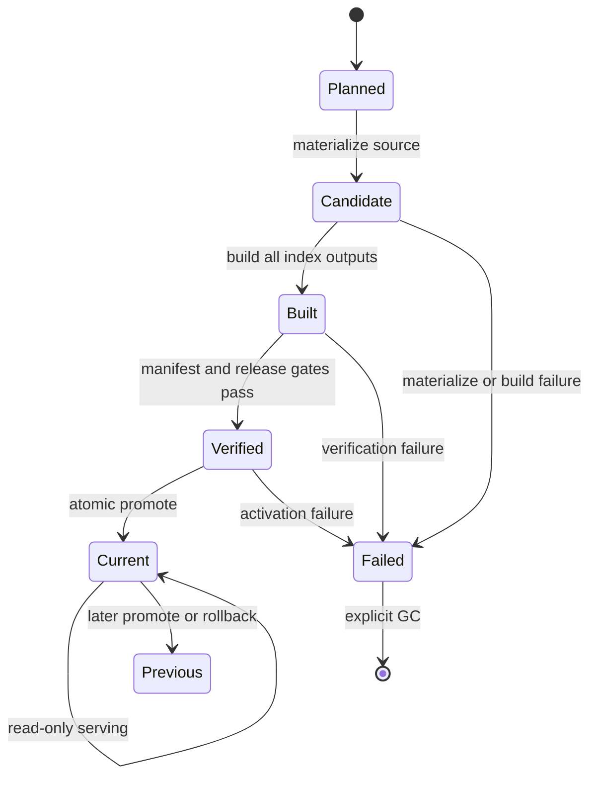

# Production release and index development guide

> 2026-06-12 historical-only notice: 이 문서는 v2 `monolith-and-shards` 구현
> 계약과 이력만 기록한다. 현재 production 구현의 source of truth가 아니며,
> 새 코드나 운영 절차의 근거로 사용하지 않는다. 최종 기준은
> [`v3-final-production-master-development-guide.md`](v3-final-production-master-development-guide.md)
> 이다. v3는 v1/v2 호환 없이 `global_spine.sqlite`와 company shards를
> production 기본 artifact로 사용하고, monolith는 production에서 제외한다.

이 문서는 `krw-ontology`의 release transaction, agent index build, shard serving,
CLI, 검증, 운영 관측성을 구현하고 변경할 때 사용하는 개발 기준 문서다.

상세 설계 배경과 대안 검토는
[`production-release-index-architecture.md`](production-release-index-architecture.md)에
남긴다. 이 문서는 v2 당시 구현 계약과 개발 절차를 역사 기록으로만 사용한다.

기준일: 2026-06-11

## 1. 목표와 범위

이 시스템의 목표는 artifact와 모든 index 산출물을 하나의 검증된 immutable
release로 만들고, `current` pointer만 atomic하게 바꾸는 것이다.

다음 경로를 같은 안전성 모델로 다룬다.

- 전체 ontology root publish
- 일부 ticker publish
- dev publish
- queue batch publish
- local promote와 rollback
- remote prod publish와 rollback
- monolith 및 shard index build
- MCP serving hot swap
- release와 index 운영 진단

이 문서에서 "production"은 환경 이름 `prod`만 의미하지 않는다. `dev`,
`staging`, `prod`의 모든 release는 동일한 불변성, 검증, 실패 격리를 지켜야
한다.

## 2. 비협상 불변식

아래 규칙은 설계 선호가 아니라 코드와 테스트로 강제해야 하는 계약이다.

1. `current`는 immutable release를 가리키는 pointer다.
2. 활성 `current` release와 그 하위 파일은 직접 수정하지 않는다.
3. artifact와 index는 같은 release 단위로 함께 promote한다.
4. candidate는 검증을 모두 통과하기 전에는 serving하지 않는다.
5. build 또는 verification 실패 시 기존 `current`는 바뀌지 않는다.
6. promote 이후 reload 또는 health 실패 시 이전 release로 복구한다.
7. 실패한 candidate는 promotable namespace에서 `failed/`로 격리한다.
8. index target은 완성되고 검증된 임시 DB로만 atomic replace한다.
9. fragment cache는 성능 최적화일 뿐 correctness의 필수 조건이 아니다.
10. cache 손상은 source artifact 재compile로 복구한다.
11. 새 요청은 새 `current`를 사용하고, 기존 in-flight 요청은 기존 release로
    끝낸다.
12. 읽기 전용 명령은 `current`를 읽을 수 있지만 쓰기 명령은 거부해야 한다.

테스트 또는 새 CLI가 이 규칙을 우회하면 구현 결함으로 간주한다.

## 3. 용어

| 용어 | 의미 |
| --- | --- |
| running root | pipeline과 quality repair가 artifact를 변경하는 mutable 작업 공간 |
| releases root | 환경별 release를 보관하는 상위 경로 |
| env root | `<releases_root>/<env>` |
| candidate | build와 verification 중인 아직 활성화되지 않은 release |
| release | manifest와 검증 산출물을 가진 immutable 디렉터리 |
| current | env root 안에서 활성 release id를 가리키는 심볼릭 링크 |
| failed release | transaction 실패 후 `<env>/failed/`로 격리된 candidate |
| promote | 검증 후 `current`를 candidate로 atomic 전환하는 작업 |
| rollback | 이전 또는 지정 release를 다시 검증한 후 promote하는 작업 |
| monolith | 전체 데이터를 담은 `agent_index.sqlite` |
| company shard | 한 ticker의 데이터를 담은 `indexes/companies/<TICKER>.sqlite` |
| global index | 전체 ticker 탐색을 위한 global catalog 또는 global topics DB |
| fragment | artifact 하나를 compile한 content-addressed SQLite cache entry |

## 4. 파일 시스템 계약

### 4.1 Running root

```text
<running_root>/
  companies/
    <TICKER>/
      sources/
      ontology/
      indexes/
  indexes/
    agent_index.sqlite
  .krw_pipeline/
```

Running root는 mutable이다. pipeline, queue, quality repair, 직접 `index build`는
이 공간에서 실행할 수 있다.

### 4.2 Release root

```text
<releases_root>/
  dev/
    current -> 20260611T031500Z_abcd1234
    release_events.jsonl
    events/
      20260611T031500Z_abcd1234.jsonl
    .index_fragment_cache/
    failed/
      20260611T030100Z_failed/
        failure.json
    20260611T031500Z_abcd1234/
      manifest.json
      companies/
      indexes/
        agent_index.sqlite
        artifact_manifest.json
        build_plan.json
        build_progress.jsonl
        build_summary.json
        global_catalog.sqlite
        global_topics.sqlite
        shard_manifest.json
        companies/
          AAPL.sqlite
          MSFT.sqlite
      verify/
        release_verify.json
        smoke_queries.json
        ranking_quality.json
  staging/
  prod/
```

`current`의 link target은 같은 env root 안의 release id다. 활성 release의 실제
경로를 직접 지정하더라도 `current`와 같은 target이면 쓰기 명령은 거부한다.

### 4.3 Reserved env entries

Release 목록과 GC는 다음 운영 경로를 release id로 취급하지 않는다.

- `current`
- `current.next`
- `failed`
- `events`
- `locks`
- hidden directory
- release event log

새 운영 디렉터리를 env root에 추가할 때는
`RELEASE_ENV_RESERVED_DIRNAMES`에도 추가해야 한다.

## 5. Release 상태 전이



핵심 전이 규칙:

- `Planned`는 파일을 쓰지 않는다.
- `Candidate`, `Built`, `Verified`는 serving 대상이 아니다.
- `Current` 전이는 `promote_local_release()` 또는 remote activation script만
  수행한다.
- `Failed`는 일반 release 목록과 rollback target에서 제외된다.

## 6. 코드 소유 경계

| 영역 | 주 파일 | 책임 |
| --- | --- | --- |
| CLI orchestration | `src/krw_ontology/cli/main.py` | command 계약, release transaction 조합, local/remote activation |
| Release model | `src/krw_ontology/release.py` | manifest, verification, reports, promote, rollback, quarantine |
| Index build | `src/krw_ontology/agent_index/builder.py` | plan, fragment compile/cache, merge, atomic output, shard build/verify |
| Serving router | `src/krw_ontology/agent_index/router.py` | monolith/shard/global topics routing |
| MCP serving | `src/krw_ontology/mcp_server/` | persistent store pool, hot swap, health, metrics |
| Observability | `src/krw_ontology/observability.py`, `ops/observability/` | deployable alerts, receivers, dashboard, doctor |
| Queue | `src/krw_ontology/pipeline/queue.py`, CLI worker helpers | mutable pipeline 작업과 batch release publish |

현재 release transaction 조합은 CLI helper 함수로 구현되어 있다. 별도
`ReleaseTransaction` class를 도입하려면 실제 중복이나 상태 복구 복잡도를
줄이는 경우에만 진행한다. class 도입 자체가 목표는 아니다.

## 7. Release transaction 알고리즘

### 7.1 전체 root publish

`release publish`, `release build`, `release import-current`가 공유하는 논리:

```text
normalize env and release id
resolve source root
plan source index content
compare verified current content signature
if identical and not force-release:
    return no-op
create candidate release root
materialize source into candidate
generate and verify candidate source manifest
build candidate indexes from source manifest only
write manifest v2
verify filesystem, manifest, all index outputs, smoke, ranking
write verification reports
if promote:
    atomic current switch
return transaction result
```

실패하면 candidate를 `<env>/failed/<release_id>`로 이동하고 `failure.json`을
기록한다.

### 7.2 Ticker publish

`publish-ticker`, `update-ticker --publish`, `build-research-pipeline
--publish-root`, queue batch publish가 공유하는 논리:

```text
resolve current release if present
create candidate
copy current release content into candidate, or start empty for initial publish
overlay changed ticker directories from running root
generate and verify candidate source manifest
plan candidate artifact content from source manifest only
perform verified-content no-op check
build all required candidate index outputs
write manifest and verification reports
promote once for the whole batch
```

Ticker가 여러 개인 batch도 ticker마다 `current`를 바꾸지 않는다. 한 candidate에
모든 변경을 반영하고 한 번만 promote한다.

### 7.3 Verified-content no-op

No-op 판단은 artifact별 `(relative_path, cache_key)`의 deterministic signature를
비교한다. cache hit 여부나 mtime은 비교 대상이 아니다.

No-op이 허용되려면 현재 release의 다음 보고서가 모두 존재하고 `ok=true`여야
한다.

- `verify/release_verify.json`
- `verify/smoke_queries.json`
- `verify/ranking_quality.json`

조건이 충족되면 candidate를 남기지 않고 build와 promote를 생략한다.
`--force-release`는 이 최적화를 명시적으로 우회한다.

## 8. Index build 알고리즘

### 8.1 Public API

```python
plan_agent_index(
    root,
    index_path=None,
    cache_root=None,
    layout="monolith-and-shards",
    workers=None,
    source_manifest_path=None,
)

build_agent_index(
    root,
    index_path=None,
    force=True,
    cache_root=None,
    workers=None,
    layout="monolith-and-shards",
    source_manifest_path=None,
)
```

지원 layout:

- `monolith`
- `monolith-and-shards`
- `shards`

프로덕션 기본은 `monolith-and-shards`다. Monolith는 전체 범위 질의와
cross-check 검증을 위해 계속 생성한다.

### 8.2 BuildPlan

`plan_agent_index()`는 파일을 쓰지 않는 deterministic planning API다.

각 artifact plan item은 다음을 포함한다.

- ticker
- document type와 period
- artifact index 상대 경로
- 실제 입력 파일 목록
- 누락 입력 파일
- 입력 byte 기반 content hash
- 명시적 `builder_code_version`과 하위 builder/schema version이 포함된 cache key
- 예상 fragment 경로
- cache verification 결과

Plan 전체는 다음을 포함한다.

- artifact 순서
- dirty/cached artifact
- dirty ticker
- worker 수
- layout
- cache root
- output index path
- build resource settings

mtime, 파일 발견 순서, process 완료 순서는 cache correctness에 영향을 주지
않는다.

Production release build는 candidate 내부 `indexes/source_manifest.json`을 먼저
생성하고 검증한 뒤 manifest-only discovery로 실행한다. Artifact identity는
`artifact_index.json`의 `ticker`, `document_type`, `doc_type_key`, `period`를
필수 canonical metadata로 요구하며, 경로나 legacy layout에서 값을 추론하지
않는다. Debug/개발용 filesystem scan API는 남아 있어도 production promote
경로의 권위 있는 입력 목록은 source manifest다.

### 8.3 Fragment cache

기본 cache root:

```text
<root.parent>/.index_fragment_cache
```

환경변수 override:

```bash
export KRW_INDEX_FRAGMENT_CACHE_ROOT=/shared/krw-index-cache
```

Cache hit는 파일 존재만으로 인정하지 않는다.

필수 검증:

- SQLite `PRAGMA integrity_check == ok`
- fragment metadata table 존재
- cache key 일치
- content hash 일치
- builder version 일치
- builder code version 일치
- schema version 일치

손상되거나 version이 맞지 않는 fragment는 miss로 취급하고 source artifact에서
재compile한다.

### 8.4 Parallel compile과 single writer merge

Dirty artifact가 2개 이상이고 worker가 2 이상이면 `ProcessPoolExecutor`로
fragment compile을 병렬화한다.

Worker submission은 `estimated_bytes`가 큰 artifact부터 시작하고, 같은 크기는
상대 경로 순으로 고정한다. 완료 순서와 관계없이 결과는 원래 BuildPlan 순서로
되돌려 최종 merge 결정성을 유지한다.

최종 DB merge는 한 writer가 BuildPlan 순서대로 수행한다.

이 구조를 유지하는 이유:

- SQLite 동시 writer 경합 제거
- 결정적 merge 순서 보장
- fragment 단위 재사용
- 병렬 CPU 작업과 직렬 DB publish 경계 분리

### 8.5 Atomic monolith publish

`build_agent_index()`는 target과 같은 디렉터리에 임시 DB를 만든다.

```text
indexes/.agent_index.sqlite.<pid>.<time_ns>.tmp
```

순서:

```text
build temp monolith
verify temp monolith
stage shard outputs
os.replace(temp monolith, published monolith)
publish staged shards
write build plan, artifact manifest, build summary
cleanup temp and stage paths
```

Build 실패 시 기존 target DB를 삭제하거나 교체하지 않는다.

### 8.6 Shard outputs

`monolith-and-shards`는 다음을 생성한다.

| 파일 | 역할 |
| --- | --- |
| `agent_index.sqlite` | 전체 범위 질의와 cross-check 검증용 monolith index |
| `global_catalog.sqlite` | company/document 전역 catalog |
| `global_topics.sqlite` | 전역 topic discovery |
| `companies/<TICKER>.sqlite` | ticker-scoped query/context/trace/quality |
| `shard_manifest.json` | shard 경로, hash, count 계약 |

Shard verification은 다음을 검사한다.

- 각 SQLite integrity
- shard metadata role/version
- shard file hash
- ticker별 문서, object, edge, quality event count
- company shard 합과 monolith count 일치
- global topics count와 monolith count 일치

## 9. Release manifest v2

새 manifest의 format:

```text
krw-ontology-release/v2
```

Reader와 verifier는 `krw-ontology-release/v2`만 지원한다.
`release_manifest.json` fallback과 v1 manifest accept는 production 경로에서
제거한다.

필수 상위 필드:

- `format`
- `status == "ready"`
- `env`
- `release_id`
- `index_path`
- `index_sha256`
- `agent_index_schema_version`
- `indexes`

`indexes`는 모든 serving output의 authoritative 목록이다.

```json
{
  "indexes": {
    "monolith": {
      "path": "indexes/agent_index.sqlite",
      "sha256": "..."
    },
    "global_catalog": {
      "path": "indexes/global_catalog.sqlite",
      "sha256": "..."
    },
    "global_topics": {
      "path": "indexes/global_topics.sqlite",
      "sha256": "..."
    },
    "company_shards": {
      "dir": "indexes/companies",
      "count": 2,
      "tickers": {
        "AAPL": {
          "path": "indexes/companies/AAPL.sqlite",
          "sha256": "..."
        }
      }
    },
    "shard_manifest": {
      "path": "indexes/shard_manifest.json",
      "sha256": "..."
    }
  }
}
```

모든 manifest path는 release root 기준 상대 경로여야 하고 root 밖으로 나갈 수
없다. v2 verification은 모든 output의 존재, hash, shard count를 검사한다.

상위 digest/count 필드는 빠른 검증 요약으로 유지하지만, 다중 output 검증은
`indexes`를 기준으로 한다.

## 10. Verification gate

### 10.1 Release filesystem

- release root와 `companies/`, `indexes/` 존재
- broken symlink 없음
- `.tmp`, `.building`, `.build` 같은 임시 산출물 없음

### 10.2 Manifest

- 지원 format
- `status == ready`
- env 일치
- release id와 디렉터리 이름 일치
- 모든 index path가 상대 경로이며 release root 내부
- 모든 선언 output hash 일치

### 10.3 SQLite와 shards

- `PRAGMA integrity_check`
- 필수 table/view
- build metadata와 schema version
- shard/global output 일관성

### 10.4 Serving smoke

Production publish와 promote는 실제 serving SDK 및 MCP wrapper를 연다.

검사 범위:

- index context
- company와 document 목록
- ticker query와 compact query
- topic discovery
- trace
- compare
- MCP tool response shaping

### 10.5 Ranking quality

Shard router와 monolith의 global topic 결과를 deterministic sample로 비교한다.

기록 항목:

- route mode
- fallback 여부
- top topic ids
- overlap ids, count, ratio
- rank delta
- 적용 threshold
- threshold source
- deterministic `ranking_quality_hash`

Threshold 우선순위:

```text
explicit CLI argument
environment variable
default
```

운영 threshold는 검증된 과거 `ranking_quality.json` 집합을
`release calibrate-ranking-thresholds`에 입력해 결정한다.

### 10.6 Verification reports

| 파일 | 목적 |
| --- | --- |
| `verify/release_verify.json` | 전체 release gate와 file trace |
| `verify/smoke_queries.json` | serving smoke 결과와 deterministic smoke hash |
| `verify/smoke_queries.baseline.json` | 명시적으로 승인한 smoke baseline |
| `verify/ranking_quality.json` | router/monolith ranking 비교 |
| `<env>/release_events.jsonl` | 환경 전체 promote/rollback event |
| `<env>/events/<release_id>.jsonl` | release별 promote/rollback event, release 외부 저장 |

## 11. Current 불변성 가드

쓰기 명령은 다음 두 경우를 모두 거부한다.

1. 입력 경로에 `<env>/current` 심볼릭 링크가 포함된 경우
2. 입력 경로가 `current.resolve()`와 같은 활성 release 또는 그 하위인 경우

거부 대상:

- `index build`
- `release write-manifest`
- `build-evidence-ontology`
- `e2e-matrix`
- `build-research-pipeline`
- `build-company-context`
- `update-ticker`
- `validate`
- `build-report`
- queue와 quality repair의 mutable root

허용되는 읽기 전용 경로:

- `index plan`
- `index verify`
- `index inspect`
- `index explain-last-build`
- `release verify`
- `release inspect`
- MCP serving

Active release를 변경해야 한다면 해당 release를 수정하지 말고 새 candidate를
만든 뒤 promote한다.

CLI 우회 호출을 막기 위해 `build_agent_index()` public API 자체도 root,
index path, cache root, progress log path가 active release를 가리키면 실패한다.
`write_release_manifest()`와 `write_release_verification_report()`도 같은
active-release guard를 적용한다.

## 12. CLI 계약

### 12.1 권장 전체 root flow

```bash
krw-ontology release plan \
  --from-root /data/krw-running \
  --releases-root /data/krw-releases \
  --env dev

krw-ontology release build \
  --from-root /data/krw-running \
  --releases-root /data/krw-releases \
  --env dev \
  --release-id 20260611T120000Z

krw-ontology release promote 20260611T120000Z \
  --releases-root /data/krw-releases \
  --env dev
```

한 번에 publish:

```bash
krw-ontology release publish \
  --from-root /data/krw-running \
  --releases-root /data/krw-releases \
  --env dev
```

CLI 기본값을 저장한 뒤에는 경로 인자를 반복하지 않는다.

```bash
krw-ontology config set running-root /data/krw-running
krw-ontology config set publish-root /data/krw-releases
export KRW_ONTOLOGY_ENV=dev

krw-ontology release preview
krw-ontology release force
krw-ontology quality check
krw-ontology quality gate
```

`release force`는 `release deploy --force`와 같은 production-safe force
release다. `--from-root`, `--releases-root`, `--env`를 생략하면 각각
configured `running-root`, configured `publish-root`, `KRW_ONTOLOGY_ENV` 또는
`dev`를 사용한다.

Quality read commands도 같은 `publish-root`/env 기본값을 사용한다. 즉
`quality check`, `quality tickers`, `quality explain`, `quality events`,
`quality gate`, `quality repair plan`은 기본적으로 `<publish-root>/<env>/current`
release index를 읽는다. `quality repair run`은 release를 직접 수정하지 않고
configured `running-root` 아래 quality queue/artifact를 보완한다. Repair 이후에는
다시 `release force`로 새 dev release를 만들고 quality gate를 재실행한다.

Prod는 별도 remote release root다. dev quality gate를 통과한 local current
release를 production으로 올릴 때는 다음 순서를 쓴다.

```bash
krw-ontology prod configure \
  --host ubuntu@prod \
  --remote-root /var/krw-ontology-data \
  --reload-command 'sudo systemctl restart krw-ontology-mcp' \
  --health-url http://127.0.0.1:8000/health

krw-ontology prod doctor
krw-ontology prod publish --delta
```

`prod publish`도 configured `publish-root`가 releases root이면 기본적으로
`<publish-root>/<env>/current`를 upload source로 사용한다. 다른 env의 local
release를 올릴 때만 `--from-env staging`처럼 명시한다.

기존 mutable root 최초 import:

```bash
krw-ontology release import-current \
  --from-root /data/krw-stable \
  --releases-root /data/krw-releases \
  --env dev
```

Canonical-only 전환 후 최초 release는 반드시 force로 재생성한다. 이전
`release_manifest.json`, v1 manifest, metadata가 누락된 artifact index는
운영 입력으로 인정하지 않는다.

### 12.2 Index 개발 flow

읽기 전용 plan:

```bash
krw-ontology index plan --root /data/krw-running
```

Mutable running root 또는 non-current candidate 직접 build:

```bash
krw-ontology index build \
  --root /data/krw-running \
  --layout monolith-and-shards
```

Active release 검증:

```bash
krw-ontology index verify --root /data/krw-releases/dev/current
krw-ontology index inspect --root /data/krw-releases/dev/current
krw-ontology index explain-last-build --root /data/krw-releases/dev/current
```

`index build --root .../current`는 의도적으로 실패한다.

### 12.3 Release 운영

```bash
krw-ontology release status --releases-root /data/krw-releases --env prod
krw-ontology release list --releases-root /data/krw-releases --env prod
krw-ontology release inspect <release-id> --releases-root /data/krw-releases --env prod
krw-ontology release inspect <release-id> --releases-root /data/krw-releases --env prod --failed
```

`release inspect --json`은 release 내부 manifest/report/build summary와 함께
`<env>/events/<release_id>.jsonl` audit history도 반환한다.

GC는 기본 dry-run이다.

```bash
krw-ontology release gc \
  --releases-root /data/krw-releases \
  --env prod \
  --keep 10 \
  --include-failed

krw-ontology release gc \
  --releases-root /data/krw-releases \
  --env prod \
  --keep 10 \
  --include-failed \
  --yes
```

GC는 활성 current를 항상 보존한다.

## 13. Promote와 rollback

### 13.1 Local promote

`promote_local_release()`는 다음 순서를 지킨다.

```text
verify target with smoke
first activation이면 candidate verification report finalize
previously activated release면 기존 report를 검증만 하고 파일을 쓰지 않음
prepare event log paths
create current.next symlink
os.replace(current.next, current)
append env and release event logs
```

Event log는 promote 이후 append되므로 immutable release 내부가 아니라 env root의
운영 namespace에 기록한다.

CLI `release promote`에는 선택적 activation hook이 있다.

```bash
krw-ontology release promote <release-id> \
  --releases-root /data/krw-releases \
  --env prod \
  --reload-command 'sudo systemctl restart krw-ontology-mcp' \
  --health-url http://127.0.0.1:8000/health
```

Health JSON은 `ok=true`와 대상 `release_id`를 모두 만족해야 한다.

### 13.2 Local rollback

Release id를 생략하면 current가 아닌 최신 성공 release를 선택한다.

```bash
krw-ontology release rollback \
  --releases-root /data/krw-releases \
  --env prod
```

Rollback도 target verification, atomic switch, event 기록, reload/health를 같은
방식으로 수행한다.

### 13.3 Hook 실패

Promote 또는 rollback 후 reload/health가 실패하면 이전 `current`를 복구하고
복구된 release에 대해 같은 hooks를 다시 실행한다. 명령은 성공으로 위장하지
않고 실패를 반환한다.

## 14. Remote prod transaction

`prod publish`는 source root를 직접 tar로 배포하지 않는다.

```text
local temp prod candidate materialize
build all index outputs
write prod manifest v2
run release, smoke, ranking verification
create bundle
upload bundle
remote extract into release namespace
remote verify manifest and every declared output hash
atomic current switch
reload
health JSON verification
retention cleanup
```

Pre-switch 실패:

- remote current unchanged
- 실패 release를 `failed/`로 격리

Post-switch reload/health 실패:

- 이전 current 복구
- activation failure log 기록
- 실패 release 격리

Remote activation은 다음 structured log를 남긴다.

```text
<remote_root>/activation_logs/<release_id>.log
<remote_root>/activation_events/<release_id>.jsonl
```

## 15. MCP serving과 hot swap

`open_ontology_store(index_path, routing="auto")`는 shard layout이 정상일 때
`OntologyStoreRouter`, 아니면 monolith `OntologyStore`를 연다.

Routing:

| 요청 | 기본 route |
| --- | --- |
| 단일 ticker query/context/trace/quality | company shard |
| 여러 ticker query/compare | shard fan-out |
| unscoped 또는 multi-ticker topic discovery | global topics |
| shard가 없거나 불완전한 경우 | monolith fallback |

MCP persistent store pool은 resolved index signature와 generation으로 bucket을
관리한다.

`current` 변경 시:

1. 새 acquire는 새 active bucket을 연다.
2. 기존 bucket은 retired 상태가 된다.
3. 기존 lease는 old store로 완료한다.
4. retired lease count가 0이 되면 old store를 닫는다.

A -> B -> A 전환에서도 generation이 달라 old A lease와 new A bucket이 섞이지
않는다.

## 16. Locking과 동시성

- Queue worker는 running root publish lock으로 동일 root의 batch index rebuild를
  직렬화한다.
- Release publish는 env current promote를 한 번만 수행한다.
- SQLite 최종 merge는 single writer다.
- Fragment compile만 process pool로 병렬화한다.
- `current.next`와 `os.replace()`로 pointer 전환을 atomic하게 만든다.
- Serving reader는 release 파일을 수정하지 않는다.

새 동시성 최적화를 추가할 때는 최종 DB에 여러 writer를 도입하지 않는다.

## 17. 실패 처리 매트릭스

| 실패 지점 | current | candidate | 반환 |
| --- | --- | --- | --- |
| source materialize | unchanged | failed 격리 | 실패 |
| fragment compile | unchanged | failed 격리 | 실패 |
| monolith merge | unchanged | failed 격리 | 실패 |
| SQLite verification | unchanged | failed 격리 | 실패 |
| shard verification | unchanged | failed 격리 | 실패 |
| manifest/hash gate | unchanged | failed 격리 | 실패 |
| smoke/ranking gate | unchanged | failed 격리 | 실패 |
| local promote 전 검증 | unchanged | release 유지 | 실패 |
| local reload/health | previous로 복구 | release 유지 또는 격리 | 실패 |
| remote pre-switch 검증 | unchanged | remote failed 격리 | 실패 |
| remote post-switch health | previous로 복구 | remote failed 격리 | 실패 |
| event log append | switch 결과 유지 | warning 기록 | 성공 + 경고 |
| cache corruption | unchanged until rebuild | source에서 재compile | 정상 진행 |

## 18. Observability

MCP `/metrics`는 다음 범주를 노출한다.

- health와 index 존재
- serving env와 release id
- document/object/shard/topic count
- store rotations
- rotation pending
- retired store와 lease
- oldest retired store age

운영 산출물:

- `ops/observability/prometheus-krw-ontology-mcp-alerts.yml`
- `ops/observability/alertmanager-krw-ontology-mcp.yml`
- `ops/observability/grafana-krw-ontology-mcp-dashboard.json`

배포 전:

```bash
krw-ontology observability render-prometheus-alerts --output <rules-path>
krw-ontology observability render-alertmanager --output <alertmanager-path>
krw-ontology observability doctor \
  --prometheus-alerts <rules-path> \
  --alertmanager <alertmanager-path> \
  --env prod \
  --write-report <report-path>
```

Prod doctor는 localhost/loopback receiver가 남아 있으면 실패한다.

## 19. 개발 변경 절차

### 19.1 Release 변경

1. 변경이 어느 상태 전이를 수정하는지 명시한다.
2. 실패 시 current와 candidate 상태를 정의한다.
3. manifest 또는 report format 변경 여부를 확인한다.
4. legacy manifest/file-name accept가 다시 생기지 않았는지 확인한다.
5. local과 remote activation script를 함께 검토한다.
6. promote/rollback/no-op/quarantine 테스트를 추가한다.

### 19.2 Index 변경

1. 입력 byte 또는 builder/schema version이 cache key에 반영되는지 확인한다.
2. BuildPlan 순서가 deterministic한지 확인한다.
3. fragment compile과 final merge 책임을 섞지 않는다.
4. 기존 target 보존 실패 테스트를 추가한다.
5. monolith와 shard count 일치 테스트를 추가한다.
6. smoke/ranking 결과 변화가 의도된 것인지 확인한다.

### 19.3 CLI 변경

명령을 아래 중 하나로 분류한다.

- read-only: current 허용
- mutable-workspace write: running root만 허용
- release transaction: candidate 생성 후 promote
- activation: verified release에 대한 pointer 변경만 허용

Mutable write 명령은 `_assert_path_not_current_release()` 또는 CLI exit wrapper를
통해 active release를 차단해야 한다.

### 19.4 Format 변경

새 format version을 추가할 때:

- writer는 새 version만 기록
- reader/verifier가 production에서 허용하는 canonical version을 명시
- path traversal과 hash 검증 유지
- local/remote verifier 동시 변경
- fixture와 tamper test 추가

## 20. 테스트 전략

### 20.1 필수 단위 테스트

- current symlink와 resolved active target 쓰기 거부
- atomic index build 실패 시 old index 보존
- artifact fingerprint와 cache key 결정성
- corrupt fragment 재compile
- parallel compile 이후 deterministic merge
- manifest v2 모든 output hash 검증
- v1 manifest와 legacy manifest filename reject
- no-op 조건과 `--force-release`
- failed candidate quarantine metadata
- promote와 rollback event
- reload/health 실패 복구
- GC current 보호
- router route와 fallback
- MCP old lease/new current 동시성

### 20.2 필수 통합 테스트

- full-root `release publish`
- ticker overlay publish
- queue batch 단일 promote
- remote pre-switch failure current 보존
- remote activation failure rollback
- shard와 monolith smoke/ranking 비교

### 20.3 완료 전 명령

```bash
uv run ruff check .
git diff --check
uv run pytest -q
```

Remote shell snippet을 변경했다면:

```bash
sh -n <rendered-script>
```

Observability 산출물을 변경했다면:

```bash
krw-ontology observability doctor ...
```

## 21. 완료 기준

Release/index 변경은 아래 조건을 모두 만족해야 완료다.

- public 쓰기 CLI가 active current를 직접 수정하지 않는다.
- 모든 publish가 candidate build, verification, promote 순서를 지킨다.
- build/verification 실패 시 current가 유지된다.
- failed candidate가 promotable release 목록에서 제외된다.
- manifest v2가 모든 index output을 선언하고 검증한다.
- release manifest는 `manifest.json`/`krw-ontology-release/v2`만 허용한다.
- production build 입력은 검증된 source manifest-only discovery다.
- artifact index에는 `ticker`, `document_type`, `doc_type_key`, `period`가
  명시되어 있고 누락 시 실패한다.
- monolith와 shard output이 함께 검증된다.
- no-op은 verified current에서만 동작한다.
- local/remote activation 실패가 이전 release를 복구한다.
- MCP 새 요청과 in-flight 요청의 release pinning이 보장된다.
- 운영자가 status, inspect, explain, metrics로 상태를 진단할 수 있다.
- 전체 테스트와 정적 검사가 통과한다.

## 22. 증분 성능 최적화 상태

현재 production v2는 correctness와 immutable release를 유지하면서 다음
증분 성능 계층을 포함한다.

- `source-manifest generate/verify/diff`로 canonical source manifest를 생성,
  검증, 비교한다.
- release candidate build는 candidate 내부 `indexes/source_manifest.json`을
  만든 뒤 manifest-only discovery로 index build를 실행한다.
- `index build --source-manifest`는 같은 manifest-only 입력을 재현한다.
- `build_graph.json`은 source manifest, artifact fragment, company projection,
  company shard, global catalog/topic node와 cache hit/rebuild reason을 남긴다.
- company shard cache는 ticker별 artifact cache key 묶음을 기준으로 검증된
  shard를 재사용한다.
- shard staging은 unchanged ticker shard를 cache에서 복사하고 dirty ticker만
  재생성한다.
- `prod publish --delta`는 remote current file hash map과 local candidate를
  비교해 변경 파일 bundle만 업로드하고, remote에서 current 기반 candidate를
  재구성한 뒤 기존 manifest/hash/SQLite/health 검증과 atomic activate를 수행한다.
- 사용자용 release CLI는 `release preview`, `release deploy`, `release force`,
  `release status`, `release rollback`, `release history` 흐름을 제공한다.

아직 남은 성능/운영 튜닝은 correctness 기능이 아니라 운영 효율 계층이다.

- env-level append-only build history 및 장기 dashboard 집계
- 환경별 `ci`, `prod-fast`, `prod-safe` resource profile 자동 튜닝
- content hash prefix가 포함된 default release id
- remote content-addressed blob store와 cross-release hardlink 최적화

Serving 중인 monolith를 in-place incremental update하는 방식은 최적화
목록에 포함하지 않는다. Candidate 전체 검증과 release pointer 전환보다
correctness와 복구성이 나쁘기 때문이다.

## 23. 현재 남은 운영 결정

배포 환경에서 확정해야 하는 항목:

- 실제 production ranking calibration 입력과 승인 threshold
- Prometheus alert threshold
- Alertmanager 실제 receiver URL과 secret
- release와 failed candidate retention 기간
- prod reload command와 health URL

이 값들은 코드에 임시 default로 고정하지 않는다. 운영 환경에서 렌더링하고
doctor 및 release verification 결과와 함께 승인한다.
