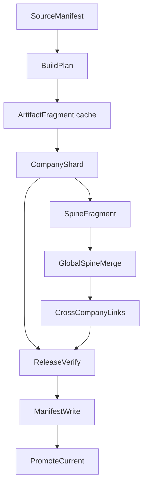

# KRW Ontology v3 final production conversion development plan

기준일: 2026-06-12

> 최종 결정, 현재 구현 상태, 남은 차단 항목, 운영 runbook의 통합 기준은
> [`v3-final-production-master-development-guide.md`](v3-final-production-master-development-guide.md)다.
> 이 문서는 실행 순서와 체크리스트를 담당한다.

이 문서는 `krw-ontology`를 v1/v2 호환 없이 v3 최종형으로 전환하기 위한
구현 실행 문서다. 최종 결정과 불변식의 source of truth는
[`v3-final-production-master-development-guide.md`](v3-final-production-master-development-guide.md)다.
schema와 build DAG의 상세 계약은
[`global-spine-company-shards-v3-development-guide.md`](global-spine-company-shards-v3-development-guide.md)가
담당한다.
이 문서는 그 결정을 실제 코드 수정, 테스트, 운영 명령, 완료 기준으로 쪼갠다.
파일별 구현 지침, CLI 계약, 운영 runbook, 리뷰 체크리스트는
[`v3-production-implementation-handoff.md`](v3-production-implementation-handoff.md)를
같이 따른다.
최종 구현 명세, 작업 패키지, 검증 기준, 운영 판단 기준은
[`v3-final-production-development-spec.md`](v3-final-production-development-spec.md)를
따른다.

전제는 명확하다.

```text
임시 구현 없음
1차 구현 없음
v1/v2 serving 호환 없음
production monolith fallback 없음
최종 target은 v3 global spine + company shards
```

## 1. 최종 목표

최종 상태:

```text
running-root
  source artifact가 수정되는 mutable 작업 공간

release force
  running-root를 읽어 새 immutable v3 release 생성

dev/current
  검증된 v3 release를 atomic하게 가리킴

quality check
  dev/current 또는 명시 release root를 읽는 read-only 검사

prod publish
  dev/current v3 release만 prod로 delta publish

MCP runtime
  global_spine.sqlite + company shards만 사용
```

최종 production release layout:

```text
<releases-root>/<env>/<release-id>/
  manifest.json
  source_manifest.json

  companies/
    <TICKER>/

  indexes/
    global_spine.sqlite
    shard_manifest.json
    build_plan.json
    build_summary.json
    build_progress.jsonl
    fragments/
      spine/
        <TICKER>.sqlite
    companies/
      <TICKER>.sqlite

  verify/
    release_verify.json
    consistency_report.json
    smoke_queries.json
    chain_smoke.json
    routing_report.json
    quality_report.json

  logs/
    release-build.log

  debug/
    monolith.sqlite      # 명시 옵션일 때만 허용
```

Production 기본에서 없어야 하는 것:

```text
indexes/agent_index.sqlite
monolith-and-shards default layout
runtime monolith fallback
startup full integrity_check
startup full sha256 scan
prod publish v1/v2 acceptance
quality scanner requiring monolith index path
```

## 2. 핵심 결정

### 2.1 `force` 의미

`force`는 새 release 생성을 강제한다.

```text
force = 새 immutable release를 만든다
no-cache = cache를 무시하고 다시 계산한다
```

따라서 일반 품질 수정 후에는:

```bash
uv run krw-ontology release force
```

로 충분하다.

다음 경우에만 `--no-cache`를 쓴다.

```text
cache 손상이 의심됨
builder cache key 버그를 검증 중임
source는 같지만 cache 산출물을 의도적으로 버리고 싶음
```

### 2.2 v1/v2 호환성

정상 production path에서 v1/v2는 거절한다.

```text
release verify startup-check
prod publish
MCP startup
quality release check
```

모두 v3 release를 기준으로 동작해야 한다.

v1/v2 코드는 migration 이전 참조 또는 테스트 fixture로 남을 수 있지만, user-facing
정상 명령이 v1/v2를 성공 target으로 받아들이면 안 된다.

### 2.3 monolith 제거

Production serving에서 `agent_index.sqlite`는 target이 아니다.

허용되는 예외:

```text
offline parity investigation
local debugging
```

이 경우에도 debug artifact는 production bundle 기본 포함 대상이 아니다.
현재 `release force`에는 debug monolith 생성 option이 없다. 향후 parity 조사 도구를
추가한다면 normal release command와 분리된 명시적 offline debug surface로 구현해야
한다.

### 2.4 quality는 gate가 아니다

`quality check`는 사용자가 원할 때 실행하는 독립 검증이다.

```text
release force가 quality check 실행을 강제하지 않음
prod publish가 quality check를 자동 gate로 사용하지 않음
quality check 실패가 current를 되돌리지 않음
```

단, quality가 읽는 대상은 반드시 immutable v3 release여야 한다.

## 3. End-to-end workflow

### 3.1 최초 설정

```bash
cd ~/krw-ontology

uv run krw-ontology config set running-root ~/krw-ontology-data-running
uv run krw-ontology config set publish-root ~/krw-ontology-data/releases
export KRW_ONTOLOGY_ENV=dev
```

의미:

```text
running-root:
  수정되는 source 작업 공간

publish-root:
  dev/prod release를 저장할 release 저장소

KRW_ONTOLOGY_ENV=dev:
  --env를 생략하면 dev/current를 대상으로 함
```

### 3.2 dev release 생성

```bash
uv run krw-ontology release force
```

동작:

```text
1. running-root의 source artifact를 읽음
2. source_manifest.json 생성
3. v3 build_plan.json 생성
4. 변경된 회사 shard build
5. spine fragment 생성 또는 cache 재사용
6. global_spine.sqlite merge
7. cross-company links 생성
8. v3 manifest.json 작성
9. offline verify 실행
10. 성공 시 dev/current atomic switch
```

기본은 background worker다.

```text
명령은 빨리 반환
실제 build는 worker가 계속 진행
watch/status로 확인
```

### 3.3 진행 확인

```bash
uv run krw-ontology release status
uv run krw-ontology release watch
```

`status`가 보여야 하는 것:

```text
current release id
running worker pid
candidate release id
phase
progress counts
latest error
manifest format
index layout
global spine path
company shard count
```

`watch`가 보여야 하는 것:

```text
worker log
build phase transitions
per-node progress
verification result
promotion result
failure reason
```

### 3.4 quality 확인

```bash
uv run krw-ontology quality check
```

동작:

```text
1. publish-root + env에서 current release resolve
2. manifest.json format v3 확인
3. global_spine.sqlite open
4. shard_manifest.json open
5. company shards를 필요한 범위만 open
6. consistency와 quality events 집계
7. report 출력
```

중요:

```text
quality check는 release를 수정하지 않음
quality check는 index를 rebuild하지 않음
quality check는 agent_index.sqlite를 요구하지 않음
```

품질 문제 수정 후:

```bash
uv run krw-ontology release force
uv run krw-ontology quality check
```

이유:

```text
quality가 읽는 것은 current release
수정은 running-root/source에서 발생
수정 결과가 release에 반영되려면 새 release가 필요
```

### 3.5 prod publish

```bash
uv run krw-ontology prod publish-dev
```

동작:

```text
1. dev/current resolve
2. v3 manifest preflight
3. verification report preflight
4. prod candidate 생성
5. delta bundle 작성
6. remote 또는 local prod root에 upload
7. remote activation preflight
8. prod/current atomic switch
9. MCP reload
10. health release_id 확인
11. 실패 시 rollback
```

prod publish는 v1/v2를 거절해야 한다.

```text
format != krw-ontology-release/v3 -> fail
index_layout != global-spine-and-company-shards -> fail
monolith_required == true -> fail
```

### 3.6 MCP runtime

MCP startup:

```text
resolve prod/current
verify_release_startup_v3
open health port quickly
lazy initialize OntologySpineRouter
serve tools from global spine + company shards
```

MCP startup에서 금지:

```text
81GB integrity_check
full release sha256
full shard scan
ranking smoke
quality scan
monolith open
```

## 4. Component implementation plan

### 4.1 v3 schema

Files:

```text
src/krw_ontology/agent_index/spine_schema.py
tests/unit/test_spine_schema.py
```

Required behavior:

```text
create global spine tables
create required indexes
write/read metadata
validate schema version
support deterministic SQLite setup
```

Tables:

```text
metadata
global_object_locator
global_document_catalog
global_edge_spine
global_factor_spine
global_topic_spine
global_metric_spine
global_entity_spine
global_counterparty_spine
global_chain_index
global_key_stats
global_search_fts
```

Acceptance:

```text
empty global spine DB 생성 가능
all required tables exist
metadata schema_version matches constant
FTS table exists
```

### 4.2 company shard builder

Files:

```text
src/krw_ontology/agent_index/spine_builder.py
tests/unit/test_spine_builder.py
```

Required behavior:

```text
source artifact에서 직접 company shard 생성
monolith를 입력으로 사용하지 않음
한 shard에는 한 ticker만 포함
documents/objects/edges/quality_events 보존
기존 OntologyStore가 읽을 수 있는 호환 테이블 유지
shard metadata 기록
cache hit 검증 후 재사용
cache corrupt 시 source에서 rebuild
```

Cache key:

```text
company_source_manifest_hash
company_shard_schema_version
company_shard_builder_version
artifact_compiler_version
```

Acceptance:

```text
one ticker source -> one company shard
same input -> deterministic output hash
changed source -> only that ticker dirty
schema version bump -> affected shards rebuild
--no-cache -> cache bypass
```

### 4.3 spine fragment emitter

Files:

```text
src/krw_ontology/agent_index/spine_builder.py
tests/unit/test_spine_builder.py
```

Required behavior:

```text
company shard를 읽어 compact spine fragment 생성
full evidence text를 fragment에 중복 저장하지 않음
object locator/document catalog/edge skeleton/topic/factor/metric/entity rows 생성
fragment metadata 기록
fragment cache hit 검증 후 재사용
```

Acceptance:

```text
every shard object has locator row
every shard document has document catalog row
fragment row order deterministic
fragment cache key includes spine projection version
```

### 4.4 global spine merge

Files:

```text
src/krw_ontology/agent_index/spine_builder.py
src/krw_ontology/agent_index/cross_company_links.py
tests/unit/test_spine_builder.py
```

Required behavior:

```text
sorted ticker order로 fragments merge
global_spine.sqlite 생성
global_search_fts build
global_key_stats build
cross-company links 생성
generic key penalty 적용
```

Acceptance:

```text
same fragments -> same global spine hash
removed ticker rows absent
new ticker rows present
global object counts match shard sums
global_chain_index endpoints resolve
```

### 4.5 v3 verifier

Files:

```text
src/krw_ontology/agent_index/spine_verify.py
src/krw_ontology/release.py
tests/unit/test_release_v3.py
```

Startup verifier:

```text
cheap
MCP startup 전용
file existence + manifest contract + lightweight SQLite open
```

Deep verifier:

```text
offline release build/publish 전용
global spine schema/integrity
company shard schema/integrity
manifest global spine/shard manifest/company shard sha consistency
release path containment
locator resolution
edge endpoint resolution
chain endpoint resolution
document catalog consistency
```

별도 integration/quality 단계:

```text
quality aggregate consistency
router/query smoke
trace/chain/compare smoke
performance baseline
prod delta reconstruction/activation/rollback rehearsal
```

이 항목들은 release artifact trust path와 실행 비용/실패 의미가 다르므로 deep
verifier 한 함수 안에 합치지 않는다.

Acceptance:

```text
missing shard -> fail
broken manifest path -> fail
orphan locator -> fail
broken chain link -> fail
digest mismatch -> fail
corrupt SQLite -> structured fail, uncaught DatabaseError 없음
standalone index verify without release manifest -> pass when schema/topology are valid
startup check does not full scan
```

### 4.6 release manifest and transaction

Files:

```text
src/krw_ontology/release.py
src/krw_ontology/cli/main.py
tests/unit/test_cli.py
tests/unit/test_release_v3.py
```

Required manifest:

```json
{
  "format": "krw-ontology-release/v3",
  "index_layout": "global-spine-and-company-shards",
  "monolith_required": false,
  "status": "ready"
}
```

Transaction behavior:

```text
candidate 생성
source materialize
v3 outputs build
manifest write
deep verify
promote current
failure quarantine
```

Acceptance:

```text
release force creates v3 release
current changes only after verify success
failure leaves previous current untouched
manifest paths are relative
v1/v2 rejected from v3 production paths
```

### 4.7 CLI simplification

Files:

```text
src/krw_ontology/cli/main.py
tests/unit/test_cli.py
```

Normal commands:

```bash
uv run krw-ontology release force
uv run krw-ontology release status
uv run krw-ontology release watch
uv run krw-ontology release cancel
uv run krw-ontology quality check
uv run krw-ontology prod publish-dev
```

Rules:

```text
normal user should not need --from-root
normal user should not need --releases-root
normal user should not need --env
normal user should not need --force-release
release force defaults to background worker
release force --foreground exists for CI/debug
```

Config resolution:

```text
explicit CLI option
config file
environment variable
documented default
```

Acceptance:

```text
release force works from config only
watch ignores .index_fragment_cache
status handles current/candidate/failed
cancel does not alter current
cleanup-interrupted never deletes current
```

### 4.8 OntologySpineRouter

Files:

```text
src/krw_ontology/agent_index/spine_router.py
src/krw_ontology/agent_index/router.py
tests/unit/test_mcp_server.py
tests/unit/test_agent_index.py
```

Required APIs:

```text
index_context
list_companies
list_documents
query
query_context
query_compact_with_diagnostics
discover_company_topics
topic_map
get_object
find_object_ids
retrieve
trace
chain
bundle
compare
quality
search_diagnostics
close
```

Routing:

```text
ticker query -> ticker shard
no-ticker query -> global search -> candidate tickers -> shard fanout
trace -> global locator -> shard trace
chain -> global chain index -> lazy shard evidence fetch
compare -> global normalizer -> shard fanout -> merged comparison
quality -> shard quality + global summary
```

Forbidden:

```text
open agent_index.sqlite as fallback
scan all shards for every query by default
return absolute local paths in public tool output
silently hide missing shard
```

Acceptance:

```text
MCP tools use OntologySpineRouter for v3 release
ticker query works
no-ticker query works
trace resolves through locator
chain returns cross-company path candidates
compare works across shards
quality returns v3 aggregate
```

### 4.9 quality v3

Files:

```text
src/krw_ontology/quality/
src/krw_ontology/cli/main.py
tests/unit/test_quality.py
tests/unit/test_cli.py
```

New scanner:

```text
QualityReleaseScanner
```

Inputs:

```text
release_root
manifest.json
indexes/global_spine.sqlite
indexes/shard_manifest.json
indexes/companies/*.sqlite
```

Checks:

```text
manifest is v3
global spine exists
shard manifest exists
every manifest shard exists
locator resolves to shard object
document catalog resolves to shard document
edge endpoints resolve
chain endpoints resolve
duplicate object ids absent
quality_events aggregated by ticker/document
routing smoke
trace smoke
chain smoke
compare smoke
```

Plan behavior:

```text
quality plan records release_id
quality plan records manifest sha256
quality plan records source_manifest sha256
quality plan records global_spine sha256
quality repair refuses stale plan by default
quality repair writes running-root only
```

Acceptance:

```text
quality check --env dev reads dev/current
quality check does not require agent_index.sqlite
quality plan stale guard works
quality repair never mutates current release
after repair, release force is required to see fixed release result
```

### 4.10 MCP startup and health

Files:

```text
src/krw_ontology/mcp_server/http_server.py
src/krw_ontology/mcp_server/server.py
tests/unit/test_mcp_server.py
```

Startup:

```text
resolve current release
read manifest
verify_release_startup_v3
set KRW_ONTOLOGY_GLOBAL_SPINE_PATH
set KRW_ONTOLOGY_SHARD_MANIFEST_PATH
do not open legacy OntologyStore for v3 startup
health port available quickly
```

Health payload:

```text
ok
release_id
env
format
index_layout
global_spine_present
shard_manifest_present
company_shard_count
router_generation
store_pool_state
```

Acceptance:

```text
MCP startup does not run full integrity_check
health works before expensive lazy shard opens
health rejects v1/v2 target
hot swap opens new current for new requests
in-flight old requests finish on old router generation
```

### 4.11 prod publish and remote activation

Files:

```text
src/krw_ontology/cli/main.py
src/krw_ontology/release.py
scripts/
tests/unit/test_cli.py
tests/integration/
```

Preflight:

```text
source release is dev/current unless explicitly overridden
source manifest format is v3
source release deep verification exists and is fresh
global spine exists and sha matches manifest
shard manifest exists and sha matches manifest
v1/v2 rejected
```

Delta package:

```text
manifest.json
source_manifest.json
indexes/global_spine.sqlite
indexes/shard_manifest.json
changed indexes/companies/*.sqlite
verify/*.json
logs or activation metadata as needed
```

Remote activation:

```text
unpack to candidate
startup preflight before stopping current MCP
atomic current switch
restart or reload MCP
health release_id matches target
rollback on failure
activation log written outside candidate
```

Acceptance:

```text
prod publish rejects v1/v2
prod publish excludes debug monolith by default
delta upload skips unchanged shards
remote activation rollback is tested
MCP health confirms target release id
```

### 4.12 frontend runtime deploy

Repository:

```text
~/krw-ontology-front
```

Expected script area:

```text
scripts/install-mcp-server-launchd.sh
package scripts around npm run prod:deploy:runtime
```

Required behavior:

```text
do not stop existing MCP before target preflight
call lightweight release startup-check for target prod current
reject non-v3 before launchd restart
restart launchd only after preflight success
health timeout checks an already-open lightweight health endpoint
confirm health release_id and index_layout
rollback or keep old service on failure
```

Forbidden:

```text
launchd restart first, then discover v1/v2 mismatch
startup deep integrity_check before opening port
health check without release_id validation
```

Acceptance:

```text
existing healthy MCP is not taken down by invalid target release
valid v3 target starts within health timeout
health shows global-spine-and-company-shards
```

## 5. Build DAG details

Required DAG:



Node record:

```json
{
  "node": "CompanyShard",
  "ticker": "MSFT",
  "status": "rebuilt",
  "reason": "company_source_hash_changed",
  "input_hash": "<hash>",
  "output_hash": "<hash>",
  "started_at": "<iso8601>",
  "finished_at": "<iso8601>",
  "duration_ms": 0
}
```

Allowed statuses:

```text
planned
cache_hit
rebuilt
failed
skipped_removed
cancelled
```

Dirty reasons:

```text
new_company
removed_company
company_source_hash_changed
artifact_hash_changed
company_shard_schema_version_changed
spine_projection_version_changed
chain_index_version_changed
builder_version_changed
cache_missing
cache_corrupt
no_cache_requested
```

## 6. New ticker, changed ticker, schema change

### 6.1 New ticker

```text
source manifest includes new ticker
build plan marks new_company
only new ticker company shard builds
new ticker spine fragment emits
global spine merges old cached fragments + new fragment
cross-company links refresh impacted keys
new release promoted
```

No manual company remapping should be required when source artifacts follow the schema.

### 6.2 Changed ticker

```text
source hash changed for ticker
only that ticker shard rebuilds
only that ticker spine fragment rebuilds
global spine merges all fragments
chain index refreshes impacted keys
```

### 6.3 Removed ticker

```text
ticker absent from source manifest
shard excluded from shard_manifest
fragment excluded from global spine merge
verify ensures no locator/chain row references removed ticker
```

### 6.4 Ontology schema change

Schema changes must be explicit version bumps.

```text
company_shard_schema_version changed -> all company shards rebuild
spine_projection_version changed -> spine fragments rebuild
chain_index_version changed -> chain links refresh
```

This is the correct cost of changing the canonical ontology contract. It prevents silent
schema drift.

## 7. Verification matrix

| stage | check | cost | when |
| --- | --- | --- | --- |
| startup | manifest v3 | cheap | MCP startup |
| startup | global spine exists | cheap | MCP startup |
| startup | SQLite open | cheap | MCP startup |
| build | shard integrity | expensive | release verify |
| build | global integrity | medium | release verify |
| build | sha256 match | expensive | release verify/publish |
| build | locator consistency | medium | release verify |
| build | chain endpoint consistency | medium | release verify |
| quality | quality events | medium | on demand |
| quality | routing/trace/chain smoke | medium | on demand |
| publish | remote manifest preflight | cheap | before MCP restart |

Startup and deep verification must stay separated.

## 8. Test plan

### 8.1 Required unit tests

```text
spine schema DDL
metadata version read/write
company shard direct build
company shard cache hit
company shard cache corrupt rebuild
spine fragment determinism
global spine deterministic merge
cross-company exact links
generic key penalty
v3 manifest write
v3 startup verifier
v3 deep verifier
release force foreground
release force background worker
release watch latest valid candidate
release cleanup interrupted
OntologySpineRouter ticker query
OntologySpineRouter no-ticker query
OntologySpineRouter trace
OntologySpineRouter chain
OntologySpineRouter compare
quality check v3 release root
quality plan stale guard
MCP health v3
prod publish rejects v2
prod publish delta manifest
```

### 8.2 Required integration tests

```text
mini two-ticker v3 release build
new ticker incremental build
single ticker changed warm build
missing shard verification failure
orphan locator verification failure
broken chain link verification failure
MCP startup from v3 current
MCP tool smoke through v3 router
quality check after v3 release
prod publish local dry-run
remote activation script preflight
```

### 8.3 Required performance tests

```text
cold full v3 build time
warm force no source change time
single ticker change time
global spine merge time
prod delta package size
MCP startup time
ticker query latency
no-ticker query latency
chain query latency
quality check time
```

## 9. Operator-facing command contract

Short commands must be enough.

```bash
uv run krw-ontology release force
uv run krw-ontology release watch
uv run krw-ontology release status
uv run krw-ontology quality check
uv run krw-ontology prod publish-dev
```

Long commands remain for recovery:

```bash
uv run krw-ontology release force \
  --from-root ~/krw-ontology-data-running \
  --releases-root ~/krw-ontology-data/releases \
  --env dev
```

But documentation and normal workflow should teach the short commands first.

## 10. Completion checklist

The v3 conversion is complete only when every item below is true. The checkbox
state is the current development branch status, not a reduced completion bar.

```text
[x] release force creates v3 release by default
[x] release force does not create production agent_index.sqlite
[x] dev/current v3 promotion path exists and is target-tested
[x] quality check reads dev/current v3 release
[x] quality check requires no monolith
[x] quality repair writes running-root only
[x] release force after repair uses cache unless --no-cache
[x] MCP startup uses verify_release_startup_v3
[x] MCP startup opens health without deep scan
[x] MCP runtime uses OntologySpineRouter
[ ] MCP tools pass full ticker/no-ticker/trace/chain/compare/quality parity smoke
[x] prod publish rejects v1/v2
[x] prod publish delta uploads changed v3 artifacts only
[x] remote activation preflights candidate before current switch and MCP reload
[x] remote activation rollback/health mismatch paths have targeted unit coverage
[x] front production launchd runtime script preflights v3 before restart
[x] interrupted v2 candidates are quarantined by explicit cleanup
[x] release startup-check command uses v3 global spine + shard verification only
[x] shared deep release verifier hard rejects non-v3 before opening legacy SQLite
[x] legacy v1/v2 manifest writers and startup/deep verifiers are removed
[x] release write-manifest/export-web-catalog commands use v3 release topology only
[x] index plan/build/verify/inspect/explain/cache commands use v3 global spine + shards
[x] quality check/tickers/explain/events/repair plan commands no longer accept direct agent_index paths
[x] release publish-dev creates v3 global spine + company shard releases
[x] publish-ticker/update-ticker/queue publish create v3 global spine + company shard releases
[x] direct staging/root index refresh commands use v3 terminology and never build agent_index.sqlite
[x] old v2 user-facing commands are removed, hidden, or made to reject production path
[x] targeted v3 test suite passes
[x] full CLI unit suite passes
[ ] performance baseline is recorded
```

## 11. Current branch status

Implemented or partially implemented in the current development branch:

```text
v3 development guide
global spine schema
direct company shard primitive
spine fragment emitter
global spine merge
exact cross-company links
v3 release output orchestration
v3 cache namespaces
v3 manifest writer
v3 startup verifier
v3 deep consistency verifier
release public writer/verifier v3-only single trust path
release digest enforcement for global spine, shard manifest, and company shards
standalone index verify/release digest contract separation
structured corrupt SQLite verification failure
release force v3 path
release plan v3 DAG preview
release force background worker
release status/watch/cancel worker commands
release publish-dev v3 global spine + shard path
publish-ticker/update-ticker/queue publish v3 path
release verify/startup-check v3-only command surface
release write-manifest/export-web-catalog v3-only command surface
index plan/build/verify/inspect/explain/cache v3 command surface
quality check/tickers/explain/events/repair plan v3-only command surface
MCP v3 startup preflight path
MCP v3 health payload
MCP v3 metrics/diagnostics payload
OntologySpineRouter core
quality v3 release-root scanner
quality check default dev/current v3 resolution
quality repair v3 release fingerprint stale guard
prod publish v3-only source preflight
prod candidate v3 manifest rewrite
prod delta changed-file hash manifest
remote activation v3 preflight
prod rollback v3 preflight
front production launchd runtime v3 preflight
MCP health/runtime global_spine_path payload contract
CLI release result global_spine_path contract
front MCP health reader/scripts global_spine_path contract
legacy v2 remote activation script body removal
targeted v3 unit tests
full CLI unit suite
interrupted candidate cleanup
```

Remaining full-conversion work:

```text
quality trace/chain/compare smoke expansion
router API parity completion
MCP tool internal root/index_path fixture override cleanup
remaining legacy primitive ownership and negative-fixture audit
company shard internal agent-index naming cleanup
end-to-end integration tests
release progress events
performance baseline
```

## 12. Non-negotiable review points

During code review, reject changes that do any of the following:

```text
use agent_index.sqlite as production fallback
accept v1/v2 release in production publish
run deep verification before MCP health port opens
mutate current release during quality repair
make force mean no-cache
hide missing shard by silently scanning another storage path
store full evidence text in global spine
write absolute local paths into manifest public fields
promote candidate before verification success
delete interrupted candidates without explicit cleanup command
```

## 13. Plain-language summary

v3 splits the system into two parts.

```text
global_spine.sqlite
  tells us where things are connected and which company shard to open

company shards
  hold the real evidence for each company
```

That removes the need to keep a 90GB production monolith next to the shards.

The normal operator flow becomes:

```bash
uv run krw-ontology release force
uv run krw-ontology release watch
uv run krw-ontology quality check
uv run krw-ontology prod publish-dev
```

The hard engineering rule is:

```text
Build deeply.
Verify before promote.
Start MCP lightly.
Serve without monolith.
Publish only v3.
```
