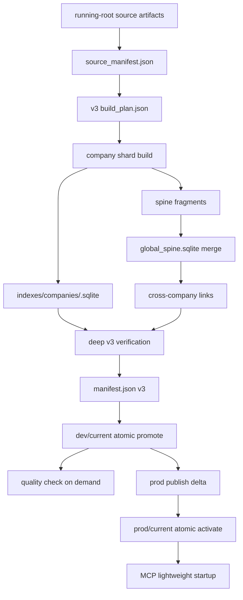

# KRW Ontology v3 production implementation handoff

기준일: 2026-06-12

> 최종 결정, 현재 구현 상태, 남은 차단 항목, 운영 runbook의 통합 기준은
> [`v3-final-production-master-development-guide.md`](v3-final-production-master-development-guide.md)다.
> 이 문서는 파일별 handoff와 구현 세부를 담당한다.

이 문서는 `krw-ontology` v3 전환을 실제 개발자가 이어서 구현, 리뷰, 검증,
운영할 수 있도록 만든 상세 개발 문서다.

관련 문서의 역할은 다음과 같다.

| 문서 | 역할 |
| --- | --- |
| `v3-final-production-master-development-guide.md` | 최종 결정, 현재 상태, 완료 기준의 source of truth |
| `v3-final-production-developer-manual.md` | 파일별 개발 지침, 구현 순서, 테스트와 review 기준 |
| `global-spine-company-shards-v3-development-guide.md` | v3 최종 아키텍처와 불변식 |
| `v3-final-production-conversion-development-plan.md` | 단계별 전환 계획과 완료 체크리스트 |
| `v3-final-production-development-spec.md` | 최종 구현 명세, 작업 패키지, 검증 기준 |
| 이 문서 | 파일별 구현 지침, 명령어 계약, 테스트, 운영 runbook |

이 문서는 임시 구현 계획이 아니다. 최종 target은 v1/v2 호환 없이
`global_spine.sqlite`와 company shards만으로 production serving을 수행하는 것이다.

## 1. 최종 상태 요약

최종 production 구조는 다음과 같다.

```text
running-root
  사람이 수정하거나 pipeline/quality repair가 수정하는 mutable source 공간

release force
  running-root를 읽어 immutable v3 release candidate 생성
  deep verification 통과 후 dev/current atomic promote

dev/current
  검증된 v3 release만 가리킴

quality check
  current release를 read-only로 읽는 선택 실행 검사

prod publish
  dev/current v3 release만 prod/current로 delta publish

MCP runtime
  global_spine.sqlite + company shards만 열어 serving
```

Production 기본 산출물:

```text
manifest.json
source_manifest.json
indexes/global_spine.sqlite
indexes/shard_manifest.json
indexes/build_plan.json
indexes/build_summary.json
indexes/fragments/spine/<TICKER>.sqlite
indexes/companies/<TICKER>.sqlite
verify/*.json
logs/*.log
```

Production 기본에서 없어야 하는 것:

```text
indexes/agent_index.sqlite
monolith-and-shards layout
runtime monolith fallback
startup PRAGMA integrity_check on large DB
startup full sha256 scan
prod publish v1/v2 acceptance
quality scanner requiring monolith index path
```

## 2. 절대 불변식

아래 항목은 코드 리뷰에서 반드시 지켜야 한다.

1. `current`는 immutable release pointer다.
2. `current`가 가리키는 release 내부 파일은 수정하지 않는다.
3. build, verify, publish 실패 시 기존 `current`는 바뀌지 않는다.
4. v3 production release format은 `krw-ontology-release/v3`만 허용한다.
5. production index layout은 `global-spine-and-company-shards`만 허용한다.
6. `monolith_required`가 `true`인 release는 production path에서 거절한다.
7. `force`는 새 release 생성을 강제한다. cache 무시는 `--no-cache`만 의미한다.
8. MCP startup은 lightweight verification만 한다.
9. deep verification은 release build 또는 publish 전 오프라인 단계에서 한다.
10. quality check는 gate가 아니다. 사용자가 원할 때만 실행한다.
11. quality repair는 running-root/source만 수정한다. release/current를 수정하지 않는다.
12. shard가 누락되면 실패해야 한다. 다른 storage path를 몰래 scan해서 숨기면 안 된다.
13. global spine에는 routing과 연결성에 필요한 compact data만 저장한다.
14. full evidence, quote, payload는 company shard에 둔다.
15. public manifest path는 release root 내부 상대 경로여야 한다.

## 3. 전체 데이터 흐름



중요한 점은 `agent_index.sqlite`가 이 흐름에 들어가지 않는다는 것이다.

## 4. Release layout 계약

최종 v3 release는 아래 구조를 따른다.

```text
<releases-root>/<env>/<release-id>/
  manifest.json
  source_manifest.json

  companies/
    <TICKER>/

  indexes/
    global_spine.sqlite
    shard_manifest.json
    build_plan.json
    build_summary.json
    build_progress.jsonl

    fragments/
      spine/
        <TICKER>.sqlite

    companies/
      <TICKER>.sqlite

  verify/
    release_verify.json
    consistency_report.json
    smoke_queries.json
    chain_smoke.json
    routing_report.json
    quality_report.json

  logs/
    release-build.log
```

`debug/monolith.sqlite` 같은 parity 조사 산출물은 정상 release layout과 manifest에
포함하지 않는다. 필요하면 release normal output 바깥에서 명시 debug 작업으로만
만든다.

## 5. Manifest v3 계약

`manifest.json` 최소 필수 필드:

```json
{
  "format": "krw-ontology-release/v3",
  "env": "dev",
  "release_id": "20260612_120000",
  "status": "ready",
  "index_layout": "global-spine-and-company-shards",
  "monolith_required": false,
  "indexes": {
    "global_spine": {
      "path": "indexes/global_spine.sqlite",
      "required": true,
      "sha256": "<sha256>",
      "schema_version": "krw-spine/v1"
    },
    "company_shards": {
      "dir": "indexes/companies",
      "required": true,
      "count": 0,
      "tickers": {}
    },
    "shard_manifest": {
      "path": "indexes/shard_manifest.json",
      "required": true,
      "sha256": "<sha256>"
    }
  }
}
```

Verifier는 다음을 거절해야 한다.

| 조건 | 실패 이유 |
| --- | --- |
| `format != krw-ontology-release/v3` | v1/v2 target 차단 |
| `index_layout != global-spine-and-company-shards` | monolith layout 차단 |
| `monolith_required == true` | production fallback 차단 |
| required index path missing | serving 불가 |
| absolute path in manifest | release portability 위반 |
| path escapes release root | 보안 및 correctness 위반 |
| shard count mismatch | topology 불일치 |
| missing verify report in publish path | 검증되지 않은 release |

## 6. 코드 소유 경계

| 영역 | 주 파일 | 책임 |
| --- | --- | --- |
| v3 schema | `src/krw_ontology/agent_index/spine_schema.py` | global spine DDL, metadata, schema version |
| v3 builder | `src/krw_ontology/agent_index/spine_builder.py` | source manifest, build DAG, shard, fragment, global spine |
| cross links | `src/krw_ontology/agent_index/cross_company_links.py` | shared factor/topic/metric/entity 기반 chain 후보 |
| v3 verifier | `src/krw_ontology/agent_index/spine_verify.py` | global/shard topology consistency |
| release model | `src/krw_ontology/release.py` | v3 manifest, startup verification, release verification |
| CLI | `src/krw_ontology/cli/main.py` | operator command surface, config defaults, publish orchestration |
| serving router | `src/krw_ontology/agent_index/spine_router.py` | global spine + shard read routing |
| router facade | `src/krw_ontology/agent_index/router.py` | v3 release open path and old store boundary |
| MCP HTTP | `src/krw_ontology/mcp_server/http_server.py` | startup preflight and health port |
| MCP tools | `src/krw_ontology/mcp_server/server.py` | tool responses, health, metrics, diagnostics |
| quality | `src/krw_ontology/quality/` | release-root scanner, plan, stale guard |
| tests | `tests/unit/` | v3 schema/build/release/CLI/MCP/quality coverage |

## 7. Build DAG 상세

`release force`와 `index build`는 같은 v3 primitive를 사용해야 한다.

필수 DAG node:

| node | 입력 | 출력 | cache |
| --- | --- | --- | --- |
| `SourceManifest` | source files | `source_manifest.json` | no |
| `BuildPlan` | source manifest, config, versions | `build_plan.json` | no |
| `CompanyShard` | ticker source artifacts | `indexes/companies/<TICKER>.sqlite` | yes |
| `SpineFragment` | company shard | `indexes/fragments/spine/<TICKER>.sqlite` | yes |
| `GlobalSpineMerge` | all spine fragments | `indexes/global_spine.sqlite` | conditional |
| `CrossCompanyLinks` | spine key tables | `global_chain_index` rows | conditional |
| `ReleaseVerify` | manifest draft, spine, shards | `verify/*.json` | no |
| `ManifestWrite` | verified outputs | `manifest.json` | no |
| `PromoteCurrent` | ready release | `current` symlink | no |

각 node record는 최소한 아래 정보를 가져야 한다.

```json
{
  "id": "CompanyShard:MSFT",
  "stage": "company_shard",
  "ticker": "MSFT",
  "status": "rebuilt",
  "reason": "company_source_hash_changed",
  "input_hash": "<hash>",
  "output_hash": "<hash>",
  "builder_version": "<version>",
  "schema_version": "<version>",
  "started_at": "<iso8601>",
  "finished_at": "<iso8601>",
  "duration_ms": 0
}
```

Allowed statuses:

```text
planned
cache_hit
rebuilt
failed
skipped_removed
cancelled
```

Dirty reasons:

```text
new_company
removed_company
company_source_hash_changed
source_artifact_hash_changed
company_shard_schema_version_changed
spine_projection_version_changed
chain_index_version_changed
builder_version_changed
cache_missing
cache_corrupt
no_cache_requested
force_release_requested
```

`force_release_requested`는 새 release candidate를 만들 이유다. 변경 없는 shard를
다시 계산해야 한다는 뜻은 아니다.

## 8. Cache 정책

v3 cache는 correctness 필수 요소가 아니라 속도 최적화다.

Cache 종류:

| cache | key 구성 | 저장 대상 |
| --- | --- | --- |
| company shard cache | company source hash, shard schema version, builder version | `indexes/companies/<TICKER>.sqlite` |
| spine fragment cache | company source hash, shard schema version, spine projection version, builder version | `indexes/fragments/spine/<TICKER>.sqlite` |

기본 규칙:

1. cache hit는 파일 존재만으로 인정하지 않는다.
2. SQLite open, metadata, schema version, cache key가 모두 맞아야 한다.
3. cache가 깨지면 실패로 끝내지 말고 source에서 rebuild한다.
4. rebuild 성공 전에는 기존 valid cache를 지우지 않는다.
5. `--no-cache`는 cache read를 우회한다.
6. `force`는 cache read를 우회하지 않는다.

운영 의미:

```text
quality 문제 수정 후 release force
  -> 변경된 ticker만 rebuild
  -> 변경 없는 shard와 spine fragment는 cache hit 가능

release force --no-cache
  -> 전체 source에서 다시 계산
  -> cache 손상 의심이나 version 검증 때만 사용
```

## 9. CLI 계약

### 9.1 최초 설정

```bash
cd ~/krw-ontology

uv run krw-ontology config set running-root ~/krw-ontology-data-running
uv run krw-ontology config set publish-root ~/krw-ontology-data/releases
export KRW_ONTOLOGY_ENV=dev
```

의미:

```text
running-root
  source를 고치는 작업 공간

publish-root
  dev/prod release 저장소

KRW_ONTOLOGY_ENV=dev
  --env 생략 시 dev/current 사용
```

### 9.2 일상 명령

운영자가 평소 써야 하는 명령은 짧아야 한다.

```bash
uv run krw-ontology release force
uv run krw-ontology release status
uv run krw-ontology release watch
uv run krw-ontology quality check
uv run krw-ontology prod publish-dev
```

긴 옵션은 복구나 디버그 때만 쓴다.

```bash
uv run krw-ontology release force \
  --from-root ~/krw-ontology-data-running \
  --releases-root ~/krw-ontology-data/releases \
  --env dev
```

### 9.3 `release force`

목적:

```text
running-root를 읽어서 새 immutable v3 release를 만들고 current를 전환한다.
```

기본 동작:

```text
background worker 시작
명령은 빨리 반환
빌드는 계속 진행
status/watch로 확인
```

명령:

```bash
uv run krw-ontology release force
```

CI 또는 디버그에서 foreground로 실행:

```bash
uv run krw-ontology release force --foreground
```

Cache를 의도적으로 버릴 때:

```bash
uv run krw-ontology release force --no-cache
```

주의:

```text
v2에서 v3로 처음 전환할 때도 release force가 맞다.
--no-cache는 필수가 아니다.
기존 source가 같아도 새 v3 release 산출물이 필요하면 force가 새 release를 만든다.
```

### 9.4 `release status`

목적:

```text
현재 env의 current release, 실행 중 worker, candidate, phase를 확인한다.
```

명령:

```bash
uv run krw-ontology release status
```

보여야 하는 정보:

```text
env
current release id
current manifest format
index layout
candidate release id
worker pid
phase
latest error
progress path
log path
```

### 9.5 `release watch`

목적:

```text
background release worker log와 build progress를 계속 본다.
```

명령:

```bash
uv run krw-ontology release watch
```

주의:

```text
watch는 .index_fragment_cache 같은 hidden cache directory를 candidate로 잡으면 안 된다.
release id를 명시하지 않아도 최신 valid candidate를 찾아야 한다.
```

### 9.6 `index plan`

목적:

```text
SQLite를 만들지 않고 v3 build DAG와 cache hit/miss 계획을 본다.
```

명령:

```bash
uv run krw-ontology index plan --root ~/krw-ontology-data-running
```

JSON:

```bash
uv run krw-ontology index plan --root ~/krw-ontology-data-running --json
```

정상 출력은 아래 의미를 가져야 한다.

```text
V3 index plan
layout: global-spine-and-company-shards
dirty_companies
cached_companies
dirty_spine_fragments
cached_spine_fragments
dag
```

`index plan`에는 production 기본값으로 `--layout monolith-and-shards`나
`--index-path agent_index.sqlite`가 있으면 안 된다.

### 9.7 `index build`

목적:

```text
release transaction 없이 특정 root에 v3 index outputs만 만든다.
```

명령:

```bash
uv run krw-ontology index build --root ~/krw-ontology-data-running
```

산출물:

```text
indexes/global_spine.sqlite
indexes/shard_manifest.json
indexes/build_plan.json
indexes/build_summary.json
indexes/fragments/spine/*.sqlite
indexes/companies/*.sqlite
```

주의:

```text
일반 production release는 release force를 사용한다.
index build는 local 디버그나 builder 검증용이다.
```

### 9.8 `index verify`

목적:

```text
v3 index outputs가 topology 기준으로 맞는지 확인한다.
```

명령:

```bash
uv run krw-ontology index verify --root ~/krw-ontology-data-running
```

성공 예:

```text
V3 index verify: ok
global_spine: ...
shard_manifest: ...
Counts: documents=... objects=... edges=... topics=...
```

실패 예:

```text
V3 index verify: failed
FAIL global_spine_missing
```

### 9.9 `index inspect`

목적:

```text
v3 index verify 결과, build plan, build summary, source manifest, shard manifest를 한 번에 본다.
```

명령:

```bash
uv run krw-ontology index inspect --root ~/krw-ontology-data-running
```

JSON:

```bash
uv run krw-ontology index inspect --root ~/krw-ontology-data-running --json
```

### 9.10 `index explain-last-build`

목적:

```text
직전 v3 build가 cache를 얼마나 썼고 어떤 global spine을 만들었는지 설명한다.
```

명령:

```bash
uv run krw-ontology index explain-last-build --root ~/krw-ontology-data-running
```

### 9.11 `index cache status`

목적:

```text
현재 build plan이 참조하는 v3 cache 파일이 존재하는지, stale cache가 있는지 본다.
```

명령:

```bash
uv run krw-ontology index cache status --root ~/krw-ontology-data-running
```

정상 출력:

```text
V3 index cache: ok
Entries: total=... referenced=... missing_referenced=0 unreferenced=0
```

### 9.12 `index cache gc`

목적:

```text
현재 build plan이 더 이상 참조하지 않는 v3 cache 파일을 정리한다.
```

Dry run:

```bash
uv run krw-ontology index cache gc --root ~/krw-ontology-data-running
```

실제 삭제:

```bash
uv run krw-ontology index cache gc --root ~/krw-ontology-data-running --yes
```

### 9.13 queue, pipeline, company-context index refresh

아래 명령들은 release를 만들지 않고 staging/root에 직접 index 산출물을 갱신하는
workflow다. v3 전환 후에도 이 명령들은 필요하지만, 용어와 산출물은
`agent_index.sqlite`가 아니라 v3 index outputs를 기준으로 해야 한다.

대상 명령:

```text
uv run krw-ontology queue run
uv run krw-ontology queue start
uv run krw-ontology build-research-pipeline
uv run krw-ontology build-company-context
```

이번 전환에서 제거한 legacy 대상:

```text
--rebuild-agent-index
--no-rebuild-agent-index
--index-path
Agent index built
Next: krw-ontology queue start --no-rebuild-agent-index
QueueIndexRebuildTarget
```

최종 user-facing 용어:

```text
--refresh-index
--no-refresh-index
V3 index refreshed
Next: krw-ontology queue start --no-refresh-index
QueueIndexRefreshTarget
```

동작 계약:

```text
refresh-index enabled
  -> target root에서 v3 source_manifest/build_plan 생성 또는 갱신
  -> indexes/companies/<TICKER>.sqlite 생성 또는 cache 재사용
  -> indexes/fragments/spine/<TICKER>.sqlite 생성 또는 cache 재사용
  -> indexes/global_spine.sqlite merge
  -> indexes/shard_manifest.json 작성
  -> indexes/build_summary.json 작성
  -> verify_spine_shard_release 또는 동일 수준의 v3 topology check 실행

refresh-index disabled
  -> source artifact만 갱신
  -> 기존 v3 index outputs를 수정하지 않음
  -> 다음 작업 안내는 release force 또는 explicit refresh-index로 표시
```

금지:

```text
build_agent_index(root, index_path=...)
indexes/agent_index.sqlite 생성
--index-path로 monolith 경로 받기
queue/build-company-context help text에서 agent index를 production 기본처럼 설명
```

테스트 변경 기준:

```text
queue run --refresh-index
  asserts indexes/global_spine.sqlite exists
  asserts indexes/shard_manifest.json exists
  asserts indexes/companies/<TICKER>.sqlite exists
  asserts indexes/agent_index.sqlite does not exist

queue run --no-refresh-index
  asserts source artifacts are updated
  asserts v3 index builder was not called

queue start --refresh-index
  spawned command line contains --refresh-index
  spawned command line does not contain --rebuild-agent-index

build-research-pipeline
  no --index-path option
  prints V3 index refreshed
  reports global_spine path and shard count

build-company-context
  uses --refresh-index/--no-refresh-index
  never calls legacy build_agent_index in normal path
```

구현 helper 권장:

```text
_build_v3_indexes_for_mutable_root(root, release_id_hint, no_cache=False)
```

이 helper는 release transaction을 수행하지 않는다. 같은 builder primitive를 쓰되
`current` symlink를 바꾸지 않고 target root 내부의 `indexes/`만 갱신한다.
정식 배포는 여전히 `release force`가 담당한다.

## 10. Quality 동작 계약

`quality check`는 release를 고치지 않는다. index도 rebuild하지 않는다.

기본 명령:

```bash
uv run krw-ontology quality check
```

기본 해석:

```text
env = --env 또는 KRW_ONTOLOGY_ENV 또는 dev
release root = <publish-root>/<env>/current
```

v3 quality scanner 입력:

```text
release_root/manifest.json
release_root/indexes/global_spine.sqlite
release_root/indexes/shard_manifest.json
release_root/indexes/companies/*.sqlite
```

검사해야 하는 항목:

```text
manifest v3 여부
global spine 존재 여부
shard manifest 존재 여부
manifest shard path 상대 경로 여부
locator object가 실제 shard object로 resolve되는지
document catalog document가 실제 shard document로 resolve되는지
edge endpoint가 locator로 resolve되는지
chain endpoint가 locator로 resolve되는지
quality_events 집계
routing smoke
trace smoke
chain smoke
compare smoke
```

품질 문제 수정 흐름:

```bash
uv run krw-ontology quality check
# source/running-root 수정
uv run krw-ontology release force
uv run krw-ontology quality check
```

이유:

```text
quality check가 읽는 것은 immutable current release
수정은 running-root에서 발생
수정 결과를 current에 반영하려면 새 release가 필요
```

현재 CLI 계약:

```text
quality check/tickers/explain/events/repair plan은 --index-path를 받지 않는다.
normal quality workflow는 release-root/current v3 release만 읽는다.
저수준 QualityScanner는 company shard 내부 구현 재사용과 unit test에만 남긴다.
```

## 11. MCP startup 계약

문제의 핵심은 MCP startup에서 deep verification을 하면 안 된다는 것이다.

금지:

```text
startup PRAGMA integrity_check on huge SQLite
startup full release sha256
startup full shard scan
startup smoke query
startup ranking quality
startup monolith open
```

허용:

```text
resolve prod/current
read manifest.json
format == krw-ontology-release/v3
index_layout == global-spine-and-company-shards
monolith_required == false
required relative paths stay inside release root
global_spine.sqlite exists
shard_manifest.json exists
SQLite can be opened lightly
health port opens quickly
```

Startup sequence:

```text
1. resolve release root
2. verify_release_startup_v3(check_sqlite=True or cheap open only)
3. set v3 runtime env paths
4. open health endpoint
5. initialize OntologySpineRouter lazily
6. serve requests
```

Health payload should include:

```text
ok
release_id
env
format
index_layout
global_spine_present
shard_manifest_present
company_shard_count
router_generation
store_pool_state
```

## 12. Prod publish 계약

기본 명령:

```bash
uv run krw-ontology prod publish-dev
```

동작:

```text
1. dev/current resolve
2. v3 manifest preflight
3. deep verification report freshness 확인
4. prod candidate 생성
5. delta package 작성
6. remote or local prod root upload
7. target preflight
8. prod/current atomic switch
9. MCP reload 또는 restart
10. health release_id 확인
11. 실패 시 rollback
```

반드시 거절:

```text
format != krw-ontology-release/v3
index_layout != global-spine-and-company-shards
monolith_required == true
missing global_spine
missing shard_manifest
missing required shard
```

Delta package 기본 포함:

```text
manifest.json
source_manifest.json
indexes/global_spine.sqlite
indexes/shard_manifest.json
changed indexes/companies/*.sqlite
verify/*.json
```

Delta package 기본 제외:

```text
debug/monolith.sqlite
indexes/agent_index.sqlite
unchanged company shards
```

## 13. Front runtime deploy 계약

대상 repository:

```text
~/krw-ontology-front
```

기존 문제:

```text
launchd restart
-> 새 MCP startup
-> startup deep verification
-> 81GB DB scan
-> health timeout
```

최종 순서:

```text
1. target prod/current resolve
2. target release startup preflight 실행
3. target이 v3가 아니면 기존 MCP를 내리지 않고 실패
4. launchd restart 또는 reload
5. health endpoint 확인
6. health release_id가 target과 같은지 확인
7. 실패 시 rollback 또는 old service 유지
```

이 repo에서 해야 하는 일:

```text
prod publish가 target v3 preflight를 보장
MCP startup이 cheap check만 수행
health payload에 release_id/index_layout 노출
```

front repo에서 해야 하는 일:

```text
install-mcp-server-launchd.sh가 restart 전에 target preflight 수행
health check가 HTTP success뿐 아니라 release_id/index_layout 확인
timeout 증가는 보조 수단으로만 사용
```

## 14. New ticker, changed ticker, schema change

### 14.1 새 ticker 추가

흐름:

```text
source manifest에 새 ticker 등장
BuildPlan marks new_company
새 ticker company shard build
새 ticker spine fragment emit
global spine merges old cached fragments + new fragment
cross-company links refresh impacted keys
verify 통과
new release promote
```

사람이 모든 회사 파일을 다시 맞출 필요는 없다. source artifact schema가 맞으면
builder가 source manifest 기준으로 새 ticker를 포함한다.

### 14.2 ticker 하나 수정

흐름:

```text
source hash changed for ticker
해당 ticker company shard rebuild
해당 ticker spine fragment rebuild
unchanged ticker shard는 cache 또는 이전 산출물 재사용
global spine compact merge
verify 통과
```

전체 90GB monolith rebuild가 없어야 한다.

### 14.3 ticker 제거

흐름:

```text
source manifest에서 ticker 사라짐
shard_manifest에서 제외
global spine merge에서 fragment 제외
verify가 removed ticker reference가 없는지 확인
```

### 14.4 ontology schema 변경

명시 version bump가 필요하다.

```text
company_shard_schema_version changed
  -> all company shards rebuild

spine_projection_version changed
  -> all spine fragments rebuild
  -> global spine rebuild

chain_index_version changed
  -> cross-company link refresh
  -> company shards는 cache 가능
```

schema 변경 비용이 큰 것은 정상이다. 대신 이 비용은 명시적이고 추적 가능해야 한다.

## 15. 성능 기대치와 측정 방식

v3의 성능 이점은 두 갈래다.

Build time:

```text
v2 monolith-and-shards
  full monolith build
  company shard build
  monolith/shard verification

v3 global-spine-and-company-shards
  changed company shard build
  changed spine fragment build
  compact global spine merge
```

Serving time:

```text
ticker query
  direct company shard open

no-ticker query
  global spine candidate selection
  limited shard fanout

trace
  global object locator
  one shard detail fetch

chain
  global chain planning
  lazy shard evidence fetch
```

반드시 기록해야 하는 baseline:

| metric | 설명 |
| --- | --- |
| cold full v3 build time | cache 없는 전체 build |
| warm force no-change time | source 변경 없는 force |
| single ticker change time | ticker 하나 수정 후 force |
| new ticker add time | 새 ticker 추가 후 force |
| global spine merge time | fragments merge 시간 |
| prod delta package size | upload 크기 |
| MCP startup time | health까지 걸린 시간 |
| ticker query latency | 특정 ticker 질문 |
| no-ticker query latency | global routing 질문 |
| trace latency | object trace |
| chain latency | cross-company chain |
| quality check time | v3 release quality |

## 16. 테스트 실행 계약

개발 중 빠른 targeted test:

```bash
uv run pytest -q tests/unit/test_spine_schema.py tests/unit/test_spine_builder.py tests/unit/test_release_v3.py -vv
```

Index CLI 변경 후:

```bash
uv run pytest -q tests/unit/test_agent_index.py -vv
```

MCP startup/router 변경 후:

```bash
uv run pytest -q tests/unit/test_mcp_server.py -vv
```

Quality 변경 후:

```bash
uv run pytest -q tests/unit/test_quality.py tests/unit/test_cli.py::TestProdCommand::test_quality_check_uses_configured_release_current_by_default -vv
```

Release CLI 변경 후:

```bash
uv run pytest -q tests/unit/test_cli.py::TestReleaseCommand -vv
```

최소 v3 회귀 suite:

```bash
uv run pytest -q \
  tests/unit/test_spine_schema.py \
  tests/unit/test_spine_builder.py \
  tests/unit/test_release_v3.py \
  tests/unit/test_agent_index.py \
  tests/unit/test_mcp_server.py \
  tests/unit/test_quality.py \
  -vv
```

문법 및 whitespace:

```bash
uv run python -m py_compile \
  src/krw_ontology/agent_index/spine_schema.py \
  src/krw_ontology/agent_index/spine_builder.py \
  src/krw_ontology/agent_index/spine_verify.py \
  src/krw_ontology/agent_index/spine_router.py \
  src/krw_ontology/release.py \
  src/krw_ontology/cli/main.py

git diff --check
```

### 16.1 2026-06-12 현재 검증된 명령

아래 명령은 현재 development branch에서 통과한 기준선이다. 이후 v3 release,
quality, MCP startup, prod publish, CLI surface를 수정하면 같은 범위를 다시
확인한다.

Full CLI unit suite:

```bash
uv run pytest -q tests/unit/test_cli.py -vv
```

최근 결과:

```text
133 passed
```

v3 core targeted suite:

```bash
uv run pytest -q \
  tests/unit/test_mcp_server.py \
  tests/unit/test_agent_index.py \
  tests/unit/test_release_v3.py \
  tests/unit/test_quality.py
```

최근 결과:

```text
116 passed, 1 skipped
```

Release CLI targeted suite:

```bash
uv run pytest -q tests/unit/test_cli.py::TestReleaseCommand -vv
```

최근 결과:

```text
33 passed
```

Quality CLI targeted suite:

```bash
uv run pytest -q \
  tests/unit/test_quality.py \
  tests/unit/test_cli.py::TestProdCommand::test_quality_check_uses_configured_release_current_by_default \
  -vv
```

최근 결과:

```text
16 passed
```

정적 확인:

```bash
uv run python -m py_compile \
  src/krw_ontology/cli/main.py \
  src/krw_ontology/release.py \
  src/krw_ontology/web_catalog.py \
  src/krw_ontology/quality/scanner.py \
  src/krw_ontology/agent_index/spine_builder.py \
  src/krw_ontology/agent_index/spine_verify.py

git diff --check
```

최근 결과:

```text
passed
```

## 17. 현재 branch 구현 상태

현재 development branch에서 확인된 구현 항목:

| 영역 | 상태 |
| --- | --- |
| global spine schema | implemented |
| company shard direct build primitive | implemented |
| spine fragment emitter | implemented |
| deterministic global spine merge | implemented |
| exact cross-company links | implemented |
| v3 release output orchestration | implemented |
| v3 cache namespace | implemented |
| v3 manifest writer | implemented |
| v3 startup verifier | implemented |
| v3 deep verifier | implemented |
| `release force` v3 path | implemented |
| `release force` background worker | implemented |
| `release plan` v3 DAG preview | implemented |
| `release status/watch/cancel` worker commands | implemented |
| `release publish-dev` v3 global spine + shard path | implemented |
| `publish-ticker`, `update-ticker --publish`, queue publish v3 path | implemented |
| `queue`, `build-research-pipeline`, `build-company-context` direct index refresh v3 path | implemented |
| `release verify/startup-check` v3-only command surface | implemented |
| `release write-manifest/export-web-catalog` v3-only command surface | implemented |
| release public writer/verifier v3-only 단일화 | implemented, verified |
| non-v3 manifest SQLite-open 전 hard reject | implemented, verified |
| global spine/shard manifest/company shard digest deep verification | implemented, verified |
| standalone index verify와 release digest 계약 분리 | implemented, verified |
| 손상 global spine structured verification failure | implemented, verified |
| `index plan/build/verify/inspect/explain/cache` v3 surface | implemented |
| full CLI unit suite | passing |
| MCP v3 startup preflight | implemented |
| MCP v3 health/metrics/diagnostics | implemented |
| MCP health/runtime `global_spine_path` payload contract | implemented, verified |
| OntologySpineRouter core | implemented |
| quality v3 release scanner | implemented |
| quality check/tickers/explain/events/repair plan v3-only CLI surface | implemented |
| quality repair v3 stale guard | implemented |
| prod publish v3 source preflight | implemented |
| prod candidate v3 manifest rewrite | implemented |
| prod delta changed-file hash manifest | implemented |
| remote activation v3 preflight | implemented |
| prod rollback v3 preflight | implemented |
| `krw-ontology-front` prod MCP launchd pre-restart v3 preflight | implemented |
| MCP external tool schema `root`/`index_path` removal | implemented, verified |
| MCP health/metrics/diagnostics v3-only surface | implemented, verified |
| front legacy data deploy/alias/queue option cleanup | implemented, verified |
| targeted v3 tests | implemented |

아직 final production complete라고 부르면 안 되는 항목:

| 영역 | 남은 일 |
| --- | --- |
| router API parity | retrieve, trace, chain, compare, topic map, quality smoke 확대 |
| quality | trace/chain/compare smoke와 대용량 성능 budget 확대 |
| MCP tool internal helpers | 일부 unit fixture용 `root/index_path` override를 test-only seam으로 격리 또는 제거 |
| legacy primitive ownership | builder/router의 reusable monolith primitive와 production v3 normal path를 명확히 분리 |
| company shard naming | 재사용 중인 agent-index primitive와 production monolith 의미 분리 |
| integration tests | end-to-end dev release, MCP startup, prod publish, rollback |
| release progress events | build DAG node별 progress JSONL을 더 풍부하게 기록 |
| performance baseline | cold/warm/single ticker/new ticker/MCP startup 기록 |

## 18. 구현 순서

남은 작업은 아래 순서로 진행한다.

### 18.1 Router parity

목표:

```text
MCP tool이 v3 router만으로 기존 user-facing 기능을 수행한다.
```

작업:

```text
retrieve API smoke 확장
trace API smoke 확장
chain API smoke 확장
compare API smoke 확장
topic_map API smoke 확장
quality API smoke 확장
missing shard failure path test
no-ticker query limited fanout test
```

완료 기준:

```text
tests/unit/test_mcp_server.py passes
no production fallback to agent_index.sqlite
health/metrics/diagnostics show v3 layout
```

### 18.2 Quality finalization

목표:

```text
quality가 v3 release topology와 shard evidence를 기준으로 동작한다.
```

작업:

```text
QualityReleaseScanner smoke coverage 확장
duplicate object id check
locator -> shard object resolution check
document catalog -> shard document resolution check
edge endpoint resolution check
chain endpoint resolution check
quality plan stale guard tests
```

완료 기준:

```text
quality check reads dev/current by default
quality check does not build or mutate
quality repair writes running-root only
release force required after repair
```

### 18.3 Prod publish integration

목표:

```text
prod publish가 v3 release만 원자적으로 activate한다.
```

작업:

```text
local dry-run fixture
delta manifest reconstruction test
remote activation shell test
health release_id mismatch rollback test
missing shard preflight failure test
v1/v2 hard reject test
debug monolith exclusion test
```

완료 기준:

```text
prod publish rejects non-v3 before upload or restart
prod/current switches only after preflight success
rollback path tested
```

### 18.4 Front runtime deploy alignment - targeted 구현 완료

목표:

```text
npm run prod:deploy:runtime이 기존 MCP를 내리기 전에 target v3를 확인한다.
```

현재 상태:

```text
~/krw-ontology-front/scripts/install-mcp-server-launchd.sh는 --load에서 launchd
bootout 전에 `release verify --startup-check --root "$KRW_ONTOLOGY_RELEASE_ROOT"
--env prod --require-current-symlink`를 실행하고, health 확인 시 target release_id와
v3 index_layout/global_spine_present를 확인하도록 수정됨.

~/krw-ontology-front/scripts/start-mcp-server-production.sh는 더 이상
KRW_ONTOLOGY_INDEX_PATH를 요구하거나 --index-path를 넘기지 않고, v3 manifest에서
global spine을 해석함.

~/krw-ontology-front/scripts/mac-worker-preflight.sh는 agent_index.sqlite 직접
SQLite check 대신 v3 startup contract와 MCP health v3 payload를 확인함.
```

작업:

```text
legacy data GCP deploy script 삭제 완료
package legacy data aliases 제거 완료
queue wrapper legacy --no-rebuild-agent-index 제거 완료
stale deploy test와 fixture를 v3 contract로 정리 완료
remaining docs/env examples legacy 문구 broad audit 유지
```

완료 기준:

```text
invalid v1/v2 prod/current가 있어도 기존 healthy MCP가 내려가지 않음
valid v3 prod/current는 health timeout 내 응답
dev/docker/runtime helper도 production 문서와 충돌하지 않음
```

### 18.5 Legacy command cleanup

목표:

```text
normal user-facing path에서 v2/monolith production command가 사라진다.
```

현재 상태:

```text
CLI normal path에서 agent_index.sqlite, --index-path, --rebuild-agent-index,
monolith-and-shards, build_agent_index() 직접 호출은 제거됨.
prepare-dev는 source 후보만 만들고 manifest/index를 쓰지 않음.
finalize-dev와 materialize-prod는 v3 manifest/global spine/company shard 기준으로 동작함.
release.py의 legacy v2 manifest writer, startup verifier, index path resolver는 제거됨.
verify_release_root는 non-v3를 SQLite open 전에 hard reject함.
```

작업:

```text
MCP tool fixture용 root/index override를 test-only seam으로 격리 또는 제거
남은 v1/v2 fixture가 rejection/negative assertion 용도인지 broad audit
builder/router의 reusable legacy primitive 소유권과 이름 정리
debug-only command가 있으면 help text에 debug-only 명시
tests 이름과 fixture를 v3 용어로 정리
```

완료 기준:

```text
operator docs가 가르치는 명령은 모두 v3
help text가 production monolith를 기본처럼 보이지 않음
v2 acceptance는 test fixture/migration reference 외에 없음
```

### 18.6 Performance baseline

목표:

```text
v3가 실제 대용량에서 어떤 비용과 효과를 내는지 숫자로 남긴다.
```

작업:

```text
cold full v3 build 측정
warm force no-change 측정
single ticker change 측정
new ticker add 측정
MCP startup 측정
quality check 측정
prod delta package size 측정
query latency smoke 측정
```

완료 기준:

```text
docs 또는 ops report에 baseline 기록
성능 regression을 비교할 기준 존재
```

## 19. 운영 runbook

### 19.1 v3 dev release 만들기

```bash
cd ~/krw-ontology
export KRW_ONTOLOGY_ENV=dev
uv run krw-ontology release force
uv run krw-ontology release watch
```

성공 확인:

```bash
uv run krw-ontology release status
uv run krw-ontology release verify \
  --startup-check \
  --root ~/krw-ontology-data/releases/dev/current \
  --env dev \
  --require-current-symlink
```

### 19.2 quality 확인

```bash
uv run krw-ontology quality check
```

문제가 있으면:

```text
1. running-root/source 수정
2. release force
3. quality check 재실행
```

### 19.3 prod publish

```bash
uv run krw-ontology prod publish-dev
```

실패 시 확인:

```text
prod publish output
remote activation log
manifest format
index_layout
release_id health mismatch
missing shard
```

### 19.4 MCP startup failure

우선 확인:

```bash
uv run krw-ontology release verify \
  --startup-check \
  --root ~/krw-ontology-data/releases/prod/current \
  --env prod \
  --require-current-symlink
```

실패 유형:

```text
v1/v2 manifest
missing global_spine
missing shard_manifest
manifest path escapes root
SQLite open failure
env mismatch
```

대응:

```text
v1/v2 manifest
  -> dev에서 v3 release 생성 후 prod publish

missing shard
  -> dev release 재생성 또는 prod delta 재전송

SQLite open failure
  -> release candidate reject, current rollback

health timeout
  -> startup deep scan이 남아 있는지 확인
```

### 19.5 interrupted build 정리

원칙:

```text
current는 삭제하지 않는다.
candidate와 failed/quarantine만 명시 cleanup한다.
```

확인:

```bash
uv run krw-ontology release status
```

정리 명령은 현재 CLI 구현 이름에 맞춰 사용하고, 삭제 대상이 `current`인지 반드시
확인한다.

## 20. 리뷰 체크리스트

PR 또는 큰 patch 리뷰에서 확인할 것:

```text
[ ] production path가 v3 manifest만 허용한다.
[ ] production path가 agent_index.sqlite를 요구하지 않는다.
[ ] force와 no-cache 의미가 섞이지 않았다.
[ ] current release 내부를 직접 쓰지 않는다.
[ ] startup verifier가 deep scan을 하지 않는다.
[ ] quality check가 release를 mutate하지 않는다.
[ ] repair가 running-root만 수정한다.
[ ] cache key에 source hash와 version constants가 포함된다.
[ ] cache corrupt path가 source rebuild로 복구된다.
[ ] manifest path가 상대 경로다.
[ ] missing shard가 failure로 드러난다.
[ ] full evidence text가 global spine에 중복 저장되지 않는다.
[ ] prod publish preflight가 MCP restart보다 앞선다.
[ ] tests가 success와 failure path를 모두 포함한다.
```

## 21. Definition of done

v3 완료는 아래가 모두 참일 때만 선언한다.

1. `release force`가 기본으로 v3 release를 만든다.
2. production release에 `indexes/agent_index.sqlite`가 필요 없다.
3. `dev/current`와 `prod/current`가 v3 release를 가리킨다.
4. MCP startup이 deep scan 없이 health를 연다.
5. MCP serving이 `global_spine.sqlite`와 company shards만 사용한다.
6. ticker/no-ticker/trace/chain/compare/quality smoke가 통과한다.
7. `quality check`가 v3 release root를 read-only로 검사한다.
8. quality repair 후에는 `release force`로 새 release를 만든다.
9. `prod publish`가 v1/v2와 monolith-required release를 거절한다.
10. prod delta publish가 global spine과 changed shards만 업로드한다.
11. remote activation이 release_id health mismatch에서 rollback한다.
12. front runtime deploy가 restart 전에 target v3 preflight를 한다.
13. legacy v2 user-facing command가 제거, hidden, 또는 hard reject 된다.
14. cold/warm/single ticker/new ticker performance baseline이 기록된다.
15. targeted unit tests와 end-to-end integration tests가 통과한다.

## 22. 초간단 설명

v3는 큰 SQLite 하나에 모든 것을 넣는 구조를 버린다.

```text
global_spine.sqlite
  어디에 무엇이 연결되어 있는지 알려주는 지도

company shards
  실제 증거와 세부 내용을 들고 있는 회사별 파일
```

사용자는 보통 이것만 쓰면 된다.

```bash
uv run krw-ontology release force
uv run krw-ontology release watch
uv run krw-ontology quality check
uv run krw-ontology prod publish-dev
```

개발자가 지켜야 하는 핵심은 이것이다.

```text
깊게 검증하고 나서 current를 바꾼다.
MCP는 가볍게 시작한다.
운영 serving은 monolith 없이 한다.
prod에는 v3만 보낸다.
```
